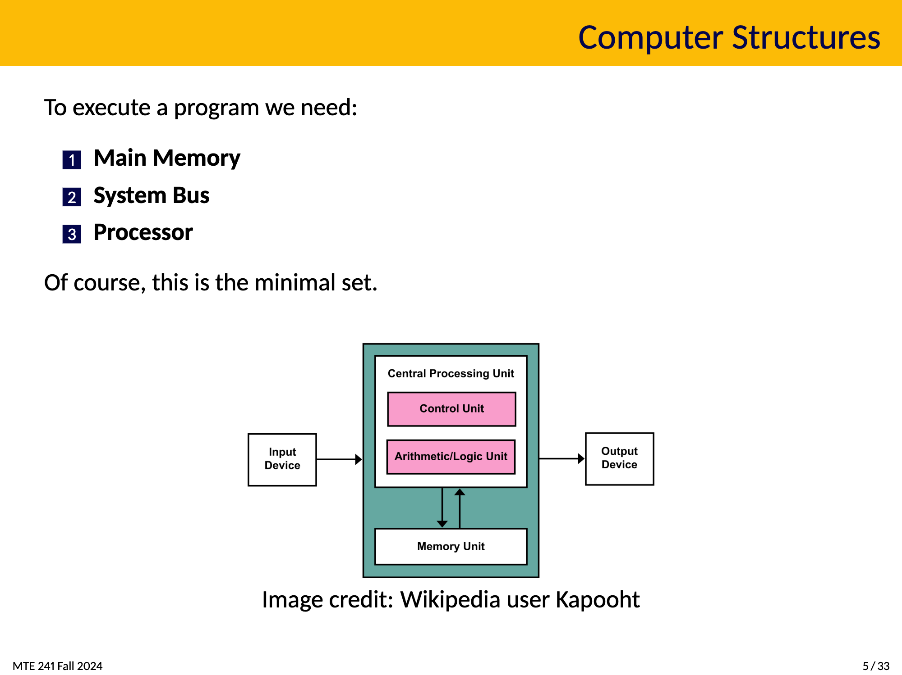
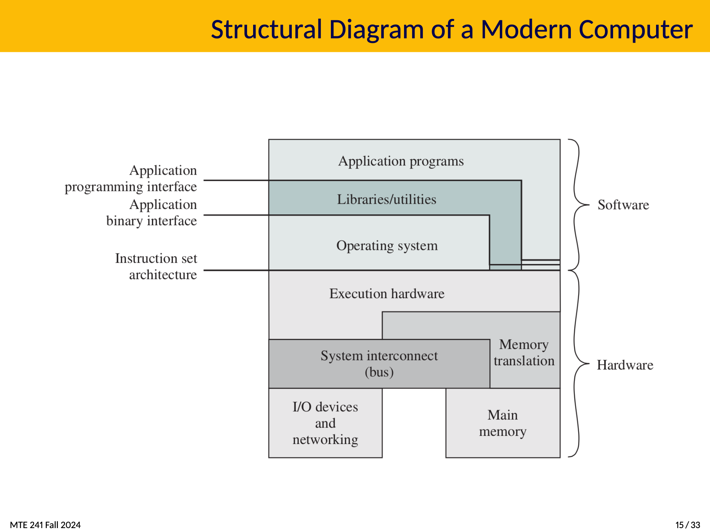

# C Toolkit

## Computer Structures

### Requirements to run a program

- Main Memory
- System Bus
- Processor

## Real-Time Systems

- Programs with deadlines
- Meant to monitor, interact with, control, o respond to the physical environment.

### How Are RTOS Systems Different?

- Safety
  RTOS:
  - RTOS has deterministic behavior and guaranteed response times, providing an extra layer of safety
  - Many come with pre-certification or certifiable safety standards
  Non-RTOS:
  - May not provide same level of predictability needed for safety-critical applications
- Performance
  RTOS:
  - Predictable and timely execution of tasks, ensuring that critical processes meet deadlines
  - Light weight with minimal overhead, enabling faster context switching and efficient resource utilization
  Non-RTOS:
  - Systems focus on overall system throughput and may not guarantee timely execution of specific tasks
- Fault-Tolerance
  RTOS:
  - Memory protection, task isolation, and robust error handling mitigate system failures
  - Can be designed to isolate faults, preventing them for affecting the entire system
  Non-RTOS:
  - may have general fault-tollerence mechanisims, but not as specialized for critical real-time applications
- Robustness
  RTOS:
  - Typically more robust in handling time-critical tasks, even under varying loads
  - Provide better error handling and recovery mechanisims for real-time applications
  Non-RTOS:
  - May offer general robustness but might not be as reliable in maintaining timing constraints
- Scalability
  RTOS:
  - Efficiently manage resources and support multi-core processors, allowing for scalibility in complex systems
  - May be limited to the number of tasks the can effectivly manage compared to a general-purpose OS
  Non-RTOS:
  - General-purpose OS, often offer better scalability for a wide range of applications and can handle a larger number of concurrent tasks
- Security
  RTOS:
  - Include security features tailored for embedded and real-time applications
  - Designed with security certifications in mind
  Non-RTOS:
  - General-purpose OS, may offer a wider range of security features and regular security updates, but these might come at the cost of deterministic behavior

## Embedded System Constrains

- Cost
- Correctness requirements
- Low memory
- Code size restrictions
- Processor speed
- Power consumption
- Available hardware

## Operating Systems

What is it?

- Programs that interface the machine with the applications programs.

Main Goal

- Dynamically allocate the shared system resources to the executing programs.
- Allow other programs to fun efficiently together.

OS Basics

- Sits between hardware and programs
- Has many goals, that often conflict with one another.

## Structure Diagram of a Modern Computer

### OS: Resource Manager

Computers have limited resources like the CPU and GPU so the OS must:

1. allocate memory on these resources
2. Keep track of allocated resources
3. Deal with conflicts

### OS: Environment Provider

- OS enables programs lime MS Word and Photoshop to run
- Abstracts away the hardware details
  - This is so program authors can abstract implementation details
