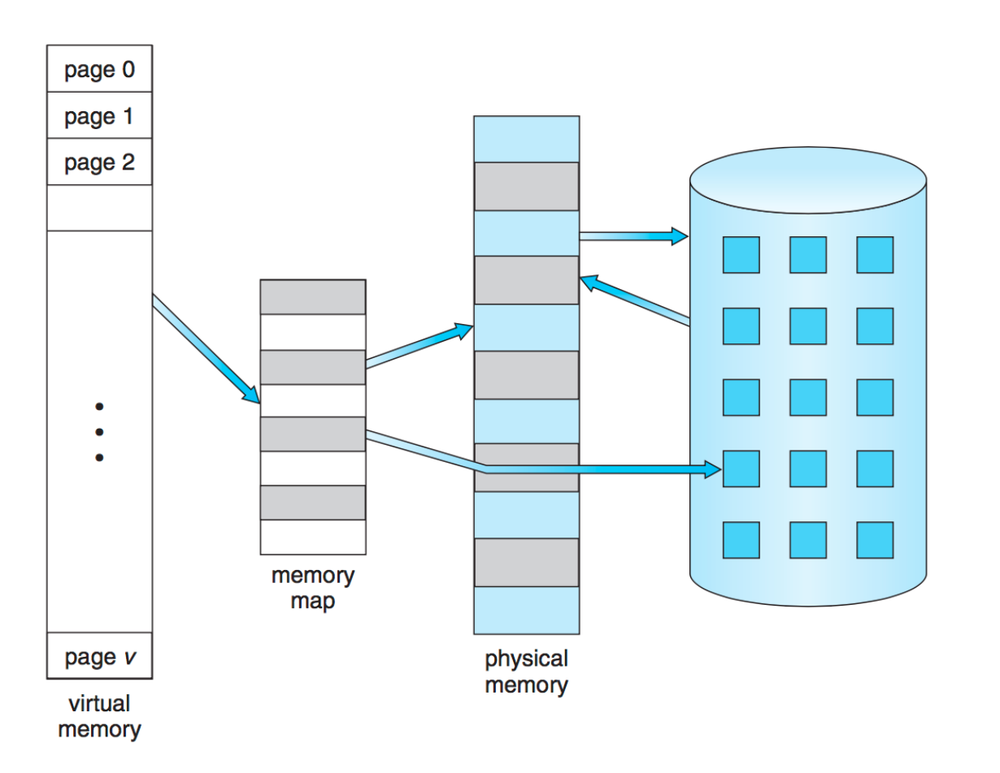
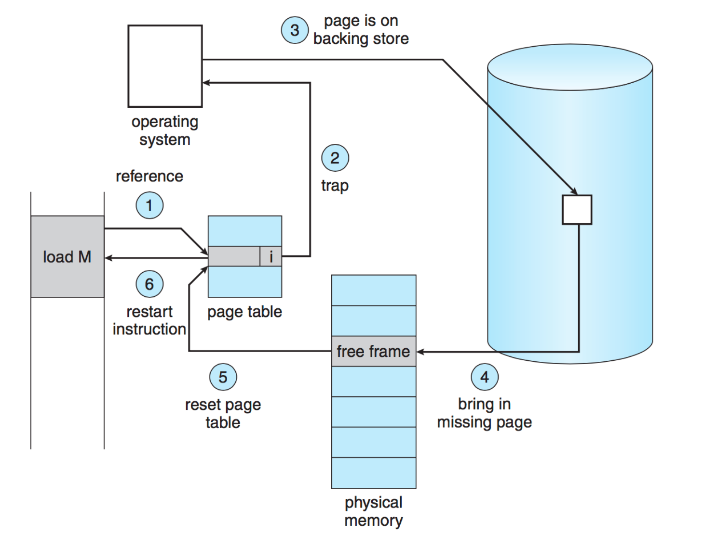
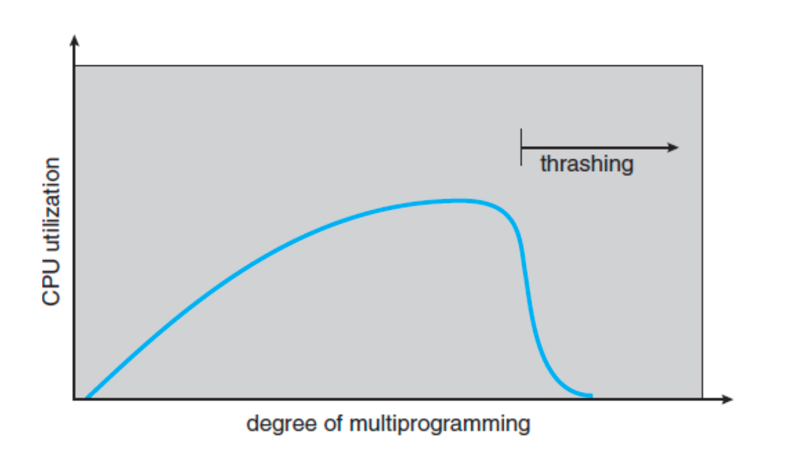

# Virtual Memory

* **Problem with Paging Alone**: Paging allows a process to be split into pages, but all the pages must fit in physical memory. If a program requires more memory than the available physical memory it cannot run
  * In modern system with large datasets (e.g., servers or supercomputers), this can be a significant limitation



## Key Concept of Virtual Memory

* **Virtual Memory**: The concept of virtual memory allows a process to run even if it exceeds the available physical memory by storing the parts of the process in **secondary storage** (e.g., disk) and loading them into memory only when needed. This makes the system appear to have much more memory that it physically does

## Benefits of Virtual Memory

1. **Program Size is Not Limited by Physical Memory**: A process can use more memory that is physically available by swapping parts of it to disk
2. **Efficient Memory Usage**: Only the necessary parts of a process are loaded into memory, reducing the physical memory footprint
3. **Reduced I/O Overhead**: Since only the needed parts of the process are swapped in and out, less I/O is needed compared to swapping entire programs in and out

## How Virtual Memory Works

* Virtual memory uses **demand paging**, where a page is only loaded into memory when it is referenced. This avoids unnecessary disk accesses.
  * **Lazy Loading**: Pages are not preloaded; they are "lazily" loaded as needed. This minimizes disk access, which is slow compared to memory access

## Page Faults

* When a page that is not in memory is accessed, a **page fault** occurs. The OS then brings the required page from disk into memory

### Steps in Handling a Page Fault

1. Check if the memory reference is valid
2. If invalid, terminate the program (segmentation fault)
3. If valid but the page is not in memory, find a free frame or evict an existing page
4. Issue a disk read request to being the new page into memory
5. Once the disk read is complete, update the page table
6. Restart the instruction that triggered the page fault



## Performance of Virtual Memory

* **Effective Access Time (EAT)**: The time to access a page is a combination of the time a access memory (when the page is in memory) and the time to load it from disk (in case of a page fault)
  * Formula:
```math
   EAT = p * $t_m$ + (1 - p) * $t_d$
```
   * `p` is the probability that the page is in memory
   * `tm` is the time to access memory
   * `td` is the time to lead the page from disk
* Disk access times dominate when page faults occur, so keeping page fault rate low is curial to maintaining performance

## Trashing

* **Trashing**: A state where the system spends most of its time swapping pages in and out of memory rather than executing processes
  * This occurs when there is insufficient physical memory, and processes compete for frames
  * **Causes**: When a process needs more pages than available memory, it repeatedly causes more page faults, leading to constant swapping
  * **Result**: The CPU is underutilized because the processes are blocked waiting for pages to load from disk, creating a downward spiral where the OS tries to start more processes worsening the problem



### Preventing Thrashing

* The solution to thrashing is to **reduce the number of active processes** in memory to free up more pages for each process. This allows processes to run with fewer page faults, improving overall system performance

## Handling Instructions with Pge Faults

* **Instruction Restart**: When a page fault occurs during the execution of an instruction, the entire instruction must be restarted after the required page is loaded. This includes:
  * Re-fetching and decoding the instructions
  * Re-fetching the operands
  * Re-executing the instruction

However, not all instructions can be restarted easily. For example, if a memory move operation overlaps pages, special care is needed to ensure that the operation is not partially completed before the page fault occurs

## Solid State Drives (SSDs) and Virtual Memory

* **SSDs vs. Hard Disk Drives (HDDs)**: The slower speed of HHDs significantly impacts virtual memory performance due to long latency and seek times. SSDs, which are much faster, have improved virtual memory performance by reducing the time it takes to load pages from secondary storage.

## Swap Files

* **Swap File**: A special file or partition on the disk is used for storing pages that are swapped out of memory. The swap file is treated as one large block of storage to improve efficiency, avoiding the overhead of managing many small files.

## Summary of Virtual Memory Advantages

1. **Illusion of Infinite Memory**: Virtual memory allows programs to use more memory than they physically available ram
2. **Efficient Memory Utilization**: By only loading necessary pages, virtual memory makes better use of physical memory
3. **Isolation and Security**: Each process operates in its own virtual address space, preventing inference between processes