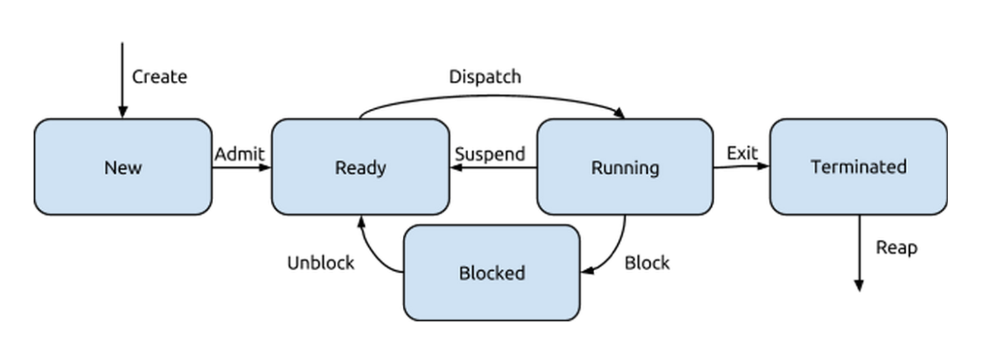
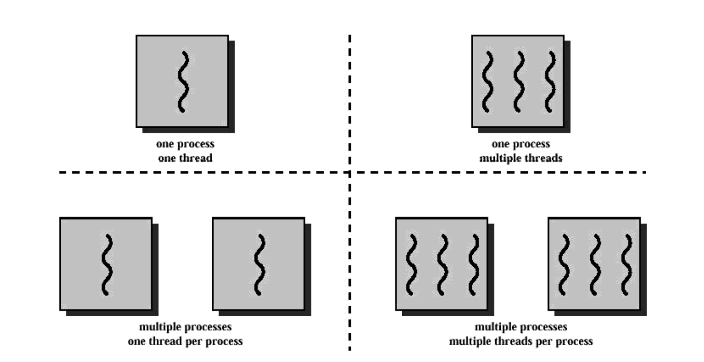
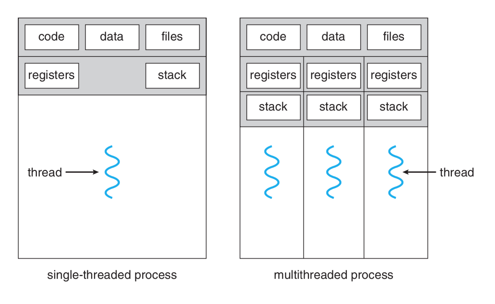

# Processes and Threads

* **Early Computing**: Early computers could only run a single task at a time. Modern systems, however, support multiple programs running concurrently, which necessitates the use of processes.
* **Definition of a Process**: A process is essentially a program in execution. It contains:
  1. **Instructions and Data**: The executable code and associated data
  2. **Current State**: The status of the program (e.g., running, blocked)
  3. **Resources**: Any additional resources needed for execution, like filed handles or memory

## Process Control Block

* A **PCB** is a data structure used by the OS to manage each process. It contains everything the OS needs to track a process, including:
  * **Identifier**: A unique ID for the process
  * **State**: Current status (e.g. running, ready)
  * **Priority**: Determines the process's importance
  * **Program Counter**: Address of the next instruction to execute
  * **Register Data**: CPU register contents
  * **Memory Pointers**: Address space pointers
  * **I/O Status Information**: Device information
  * **Accounting Information**: Resource usage stats

## Process Lifecycle

* **Creation and Destruction**: Processes can be created or destroyed during their lifecycle
  * **Process Creation**: Three main events that create processes:
    1. **System Boot-UP**: When the system starts
    2. **User Request**: When a user opens an application
    3. **Process Spawning**: A process can create a child process
  * **Process Destruction**: Process terminate in one of four ways:
    1. **Normal Exit**: Process completes it's task and exits voluntarily
    2. **Error Exit**: Voluntarily ends due to an error
    3. **Fatal Error**: Involuntary termination due to a severe error
    4. **Killed by Another Process**: Terminated by a signal from another process

## Process Relationships

* **Hierarchy**: UNIX processes from a **parent-child relationship**, with the `init` process as the ancestor of all
* **Processes Return Codes**: Values that indicate success (0) or failure (non-zero), communicated to the parent process upon termination.
* **Zombie Processes**: Occur when a child process finishes, but the parent has not yet collected it's value
* **Orphan Processes**: When a parent process terminates before the child, the `init` process adopts the orphan to ensure proper resource cleanup

## Process & Tread States and the Five-State Model

* Process can exist in different states through their lifecycle:
  1. **New**: The process has been created but not yet admitted into the ready state
  2. **Ready**: The process is prepared to run but is waiting for CPU allocation
  3. **Running**: The process is currently being executed by the CPU
  4. **Blocked**: The process is waiting for a resource (like I/O) to become available
  5. **Terminated**: The process has completed execution and is waiting for cleanup
* **Transitions**:
  * **Create** -> From nothing to "New"
  * **Admit** -> From "New" to "Ready"
  * **Dispatch** -> From "Ready" to "Running"
  * **Block** -> From "Running" to "Blocked"
  * **Unblock** -> From "Blocked" to "Ready"
  * **Exit** -> From "Running" or other states to "Terminated"
  * **Reap** -> Cleanup after a "Terminated" state

## Threads Overview

* **Threads**: Also known as **Threads of Execution**, are sequences of executable commands that can be scheduled by the CPU. Threads allow for more efficient and responsive program execution
  * **Multithreading**: A program that uses multiple thread to perform tasks concurrently. Threads share the same resources (memory, files) but have their own execution state and local variables

### Threads vs. Processes

* **Advantages of Threads Over Processes**:
  1. **Faster Creation and Termination**: Creating a thread is faster than creating a new process
  2. **Quicker Context Switching**: Switching between threads is father than between processes
  3. **Shared Memory Space**: Thread share the same memory, eliminating the need for complex Inter-Process Communication (IPC)
  4. **Better Performance**: More efficient for tasks like maintaining UI responsiveness during long operations (e.g., file upload)

### Common Usage of Threads

* **Foreground and Background Tasks**: Separating UI interactions from time-consuming operations
* **Asynchronous Processing**: Executing tasks that dont block the main program flow
* **Speed of Execution**: Using multiple threads for parallel tasks to speed up execution
* **Modular Structure**: Organizing a program's functionality into separate threads

### Drawbacks of Threads

* **Lack of Protection**: Threads in the same process share the same memory space, leading to risks if one thread inadvertently modifies data used by another
* **Error Sensitivity**: If one thread encounters and error, it can terminate the entire process, affecting all threads

## Parallelism and Performance

* **Time Slicing**: A technique where threads get a small amount of CPU tim ein a round-robin fashion, creating the illusion of parallel execution on single-core systems
  * On **multi-core systems**, actually parallel execution is possible, with multiple cores handling threads simulatniously
* **Amdahl's Law**: A formula to predict the theoretical speedup from adding more processing units:

$$
\text{Speedup} \le \frac{1}{S + \frac{(1-S)}{N}}
$$

Where:

* **S**: is the fraction of a task that must be done serially (in order)
* **N**: is the number of processors

### Key Observations on Amdahl's Law

1. **Diminishing Returns**: Adding more processors results in diminishing returns as S becomes the limiting factor
2. **Infinite Processors**: The maximum speedup is limited by the serial portion of the task