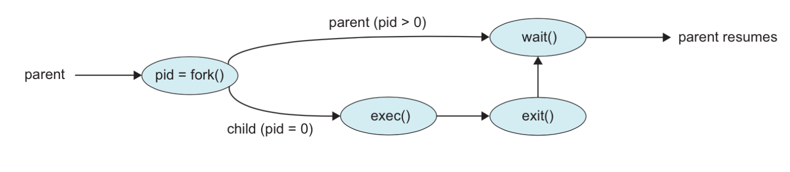

# UNIX Threads

* **UNIX Process Workflow**:
  1. A parent process creates a child process using the `fork()` system call
  2. The parent can choose to wait for the child to complete using the `wait()` system call
  3. The child process terminates with an `exit` status, and the parent can retrieve this status

## Process Creation in UNIX

* `fork()` **System Call**:
  * Creates a child process that is a **copy of the parent**
  * Both parent and child continue execution from the same point after the `fork()`
  * The return value from `fork()` indicates the process role:
    * **Negative**: `fork()` failed
    * **Zero**: This is the child process
    * **Positive**: The is the parent, and the value is the child Process Identifier (PID)



## Handling Processes Post-Fork

* After `fork()`, the OS must decide which process (parent or child) to run:
  1. **Parent runs** while child is ready
  2. **Child runs** while parent is ready
  3. **Both are ready**, but the OS might choose another process

## Fork Bomb (Denial of Service)

* A **fork bomb** is a denial-of-service attack where `fork()` is repeatedly called, creating processes exponentially
  * **Mitigation**:
    1. Limit the total number of processes per user
    2. Restrict the rate of process spawning

## POSIX Threads (pthreads)

* **POSIX Standard**: the `pthread` library is part of the POSIX standard, defining thread behavior in UNIX
  * Widely used in industry and embedded systems, offering standard interfaces for threading

### Key pthread Functions

1. `pthread_create`: Create a new thread
2. `pthread_exit`: Terminate a thread
3. `pthread_join`: Wait for a thread to finish and reteieve it's return value
4. `pthread_detach`: Allow a thread to run independently without needing to join
5. `pthread_yeild`: Yield CPU control voluntarily
6. `pthread_attr_init` and `pthread_attr_destroy`: Initialize or destory thread attributes
7. `pthread_cancel`: Cancel a running thread
8. `pthread_testcancel`: Check if a thread is marked for cancellation

## Creating a New Thread

* The `pthread_create` function signature:

```c
pthread_create(pthread_t *thread, const pthread_attr_t * attr, void *(*start_routine)(void *), void *arg);
```

* `thread`: A pointer to a thread identifier
* `attr`: Thread attributes (or NULL for defaults)
* `start_routine`: The function the new thread will execute
* `arg`: Argument passed to the start_routine

## Thread Routine Example

* **Single Argument Handling**:
  * Typically, only one argument can be passed, so a `void *` is used. To handle multiple parameters, encapsule them in a **struct**

  ```c
  void *do_something(void *arg) {
    parameters_t *arguments = (parameters_t *)arg;
    // Use the structure fields here
  }
  ```

## Thread Attributes

* Threads are **joinable** by default, meaning another thread can wait for them to finish
* **Detached threads** run independently and cannot be joined
  * Detachment can be set during creation or using `pthread_detach()`

## Termination and Joining Threads

* Threads typically end with `pthread_exit()`, returning a value to a joining thread
* `pthread_join()` retrieves a thread return value

```c
pthread_join(pthread_t thread, void **retval);
```

* **Return Value Handling**: Use a pointer (`void **`) to capture the returned value

## Shared Data and Synchronization

* **Shared Variables**: Threads can access shared data (e.g., global variables). However coordination is needed to avoid race conditions.
  * **Example**: Summing numbers concurrently requires synchronization fi the reads modify a shared variable

## Thread Cancellation

* Threads can be cancelled before completion:
  1. **Asynchronous**: Immediate termination
  2. **Deferred**: Wait until a cancellation point is reached
  * **Cancellation Pointers**: Specific functions in POSIX implicitly check for cancellation

## Cleanup Handlers

* To handle resource cleanup upon thread cancellation, use **cancellation handlers**:
  * **Registration**: `pthread_cleanup_push(void (*routine)(void *), void *arg);`
  * **Execution**: `pthread_cleanup_pop(int execute);`
  * These handlers ensure proper cleanup if a thread is cancelled mid-operation

## Summary of concepts

* UNIX Processes: Understanding fork(), exec, process creation, and termination.
* POSIX Threads: Thread creation, execution, attributes, and synchronization mechanisms.
* Synchronization Challenges: Shared data coordination and the impact of race conditions.
* Cancellation and Cleanup: Managing thread lifecycle and ensuring safe termination