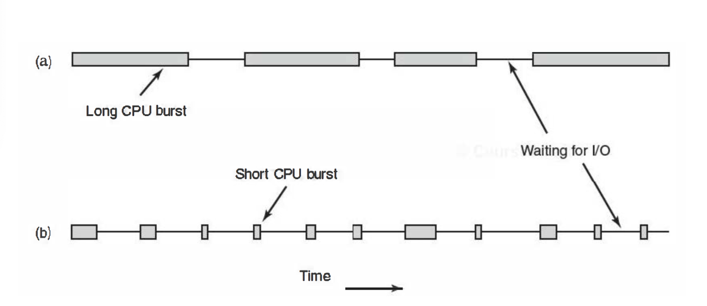

# Intro to Uniprocessor Scheduling

* **Scheduling**: The process of deciding which tasks or processes will get CPU time. This is a foundational aspect of OS design
* **Types of Scheduling**:
  * **Long-Term Scheduling**: Determines which programs will be admitted to the system and controls the transition from "new" to "ready" state
  * **Medium-Term Scheduling**: Related to **swapping**; determines when processed will be swapped in or out of main memory.
  * **Short-Term Scheduling**: Also known as the **dispatcher**, it decides which processes to execute next on the CPU
  * **I/O Scheduling**: Manages the scheduling of I/O operations

## Types of Schedulers in Detail

1. **Long-Term Scheduler**:

* Controls the load by setting limits on concurrent processes, determining overall system throughput
* Example: Server-based games like Diablo III may limit new games based on server load
* In desktop systems, users of decide what programs to open, whereas systems like Android manage it more aggressively

2. **Medium-Term Scheduler**:

* Temporarily removes processes from memory (swapping them out) to improve system performance and balance resource usage
* Processes swapped out can't execute immediately but may soon be swapped back

3. **Short-Term Scheduler (Dispatcher)**:

* Runs frequently to make quick decisions about which processes will run next
* Essential in **pre-emptive multitasking** where the OS-not the running process-decides when to switch tasks
* May switch when a process:
  * **Yields** the cpu
  * **Terminates** (voluntarily or due to an error)
  * **Blocks** (e.g. for I/O or waiting for a lock)
* Also, switches after interrupts or system calls like `fork()`, or during **time slicing** where the CPU interrupts processes at regular intervals

## Process Behaviour and CPU Scheduling

* Processes alternate between **CPU bursts** (computation) and **I/O bursts** (waiting for resources)
  * **CPU-Bound Processes**: Spend most of their time computing
  * **I/O-Bound Processes**: Spend most of their time waiting for I/O
* **Scheduling Implications**:
  * A balanced load of CPU-bound and I/O-bound processes maximizes resource utilization
  * As CPUs have become faster relative to I/O, more programs tend toward I/O bound behavior

## Scheduling Criteria

* The criteria for scheduling depends on system objectives, which vary widely:
  1. **Turnaround Time**: The total time from submission to completion of a process
  2. **Response Time**: How quickly the system responds to an input
  3. **Deadlines**: Ensuring processes meet time constrains (especially in real-time systems)
  4. **Predictability**: Consistency in response time and behavior
  5. **Throughput**: Number of processes completed within a time frame
  6. **Processor Utilization**: Maximizing CPU usage
  7. **Fairness**: Ensuring equitable CPU access
  8. **Enforcing Priorities**: Giving higher priority to important tasks
  9. **Balancing Resources**: Efficient use of system resources

## Scheduling Goals by System Type

* **Batch Systems**:
  * Prioritize throughput, turnaround time and CPU utilization
* **Interactive Systems**:
  * Prioritize response time and predictability
* **All Systems**:
  * Must consider fairness, priorities and resource balancing

## Scheduling Algorithms and Priority Handling

1. **Prioritization**:

* Each Process has a priority level, often an integer
* In UNIX, **lower numbers** indicate **higher priority** while in Windows, it's the opposite
* A higher-priority process general pre-empts lower-priority ones for CPU time

2. **Dynamic Adjustment**:

* Priorities may be modified by the OS or administrators to ensure system balance and performance
* Example: In Windows, users can set task priorities, through this can lead to system performance issues if done improperly (e.g., setting a CPU-bound task to high priority)

3. **Starvation and Fairness**:

* A purely priority-based system can lead to **starvation**, where low-priority tasks are perpetually delayed
* Scheduling must balance priority and fairness to prevent this

## Choosing the Next Process

* **Highest Priority Non-Blocked Process**:
  * Simple approach: run the highest-priority process that isn't blocked
  * Drawbacks: This method can lead to starvation for lower-priority processes, as higher-priority ones continuously take precedence
  * **Fair Scheduling**: More complex algorithms consider fairness, ensuring all processes get CPU time and preventing indefinite blocking of lower-priority tasks