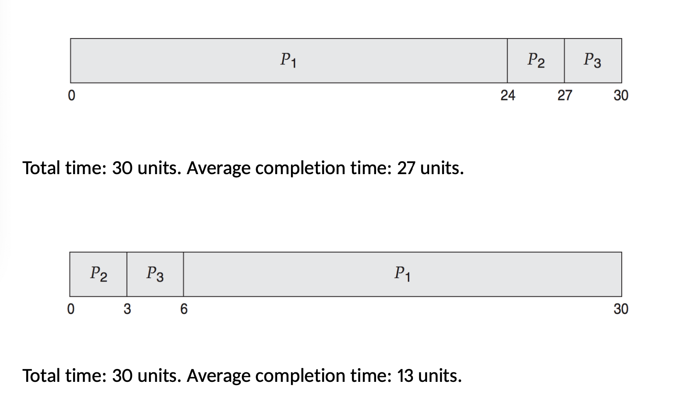
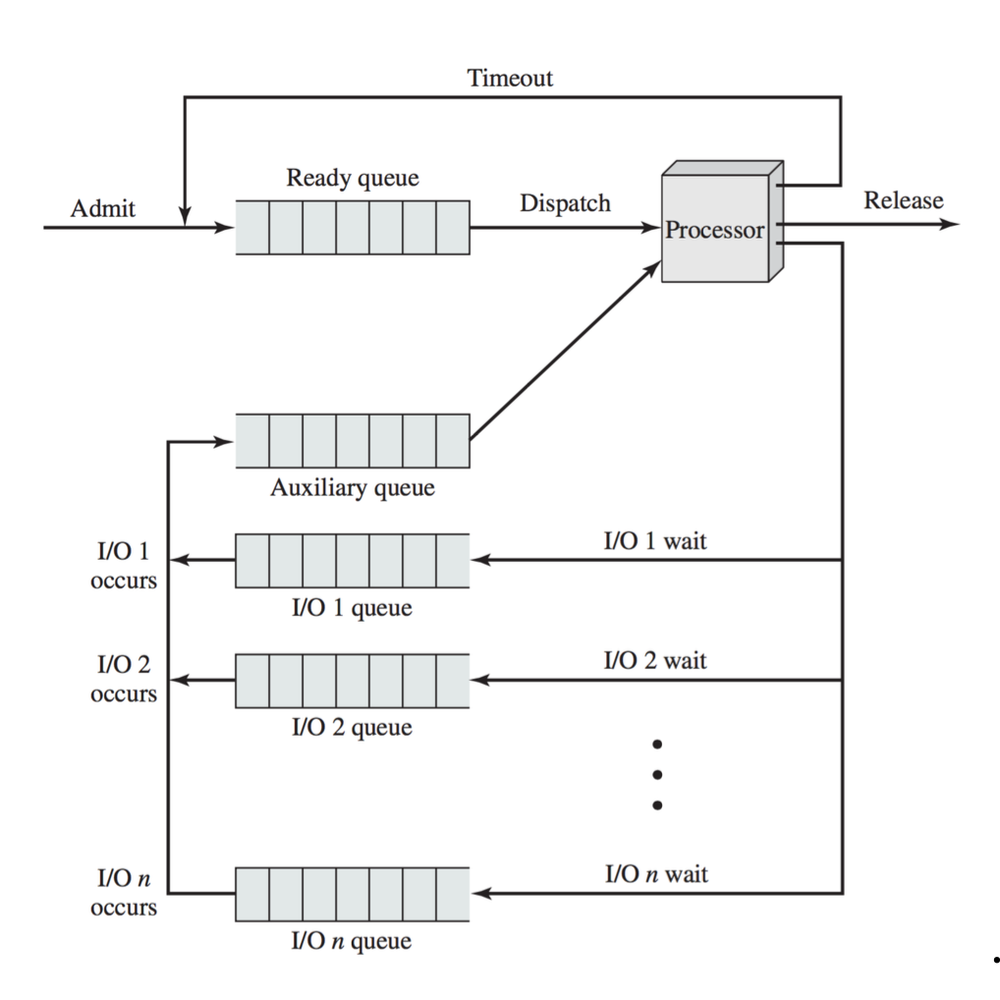
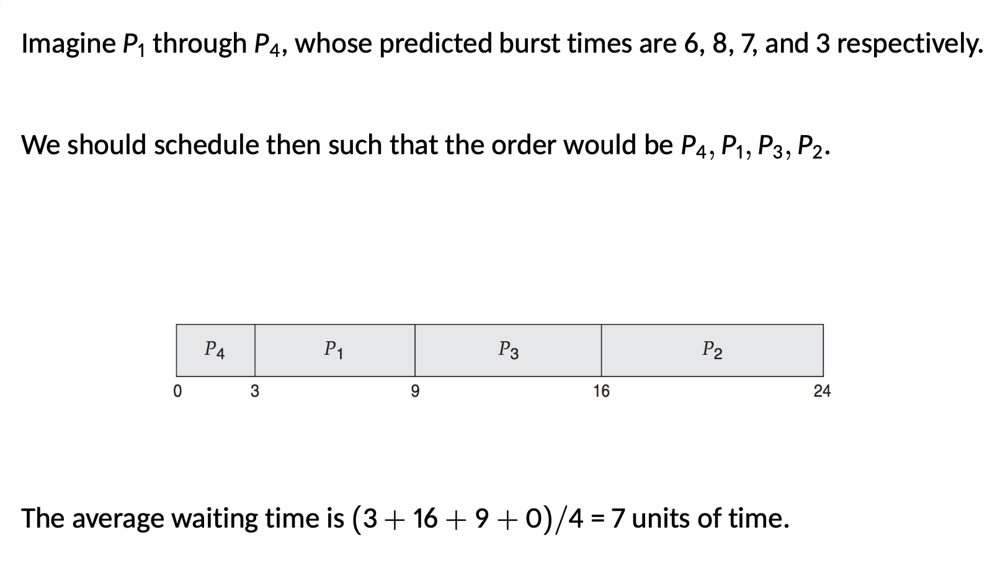
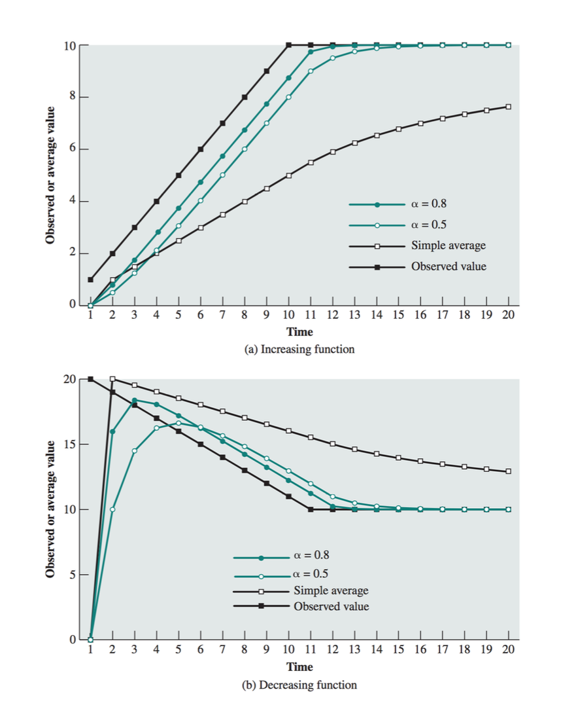

# Scheduling Algorithms

* Scheduling algorithms determine the order in which processes receive CPU time, directly impacting system responsiveness, efficiency, and resource utilization. Each algorithm has unique strengths and trade-offs

## Types of Scheduling Algorithms

1. **Highest Priority, Period**

* The CPU always selects the highest priority non-blocked process
* **Implementation**: Typically uses a priority queue, where each priority level may have its own queue
* **Drawbacks**: Vulnerable to **starvation**
* **Example Use**: Suitable for critical real-time systems where certain tasks must always take precedence

2. **First-Come, First-Served (FCFS):

* Processes are scheduled in the order they requested CPU time
* **Mechanism**: Queue-based; processes are added to the end and removed from the front
* **Issues**: Long processes can delay others, leading to **high variance in wait times** and **inefficiency** for I/O bound tasks
* **Non-Preemptive**: Once a process has CPU control, it runs to completion or until it blocks
* **Example**: Ideal for batch jobs with similar priorities but inefficient for interactive environments

3. **Round Robin**

* Extends FCFS by introducing **time slicing**. Each process gets a fixed time slice, `t`
* **Time Slice (Quantum) Selection**: If too short, system spends excessive time on context switching; if too long, interactive tasks may feel unresponsive
* **Ideal Use**: Fair for time-sharing systems, as it gives all processes an equal share of CPU-time, improving responsiveness
* **Drawbacks**: CPU-bound processes may receive more time compared to I/O-bound processes due to repeated usage of the quantum

4. **Virtual Round Robin**

* An extension of Round Robin that prioritizes I/O-bound processes by moving them to a separate **auxiliary queue** upon unblocking
* **Mechanism**: After completing I/O, processes get a boost by rejoining the ready queue with remaining time
* **Benefits**: Addresses Round Robin's imbalance by allowing I/O-bound processes faster access time to the CPU

5. **Shortest Process Next (SPN)**

* Prioritizes shortest process by scheduling the process with the shortest execution time first
* **Advantages**: Minimizes average turnaround time by completing short tasks quickly
* **Challenges**: Requires knowledge of processes duration, which is hard to predict accurately; prone to **starvation** for long processes
* **Example Use**: Used in batch processing system where process execution times can be estimated

6. **Shortest Job First (SJF)**

* Variation of SPN, focusing on scheduling processes with the smallest predicted **CPU burst** next
* **Optimal**: Proven to minimize average waiting time by prioritizing short bursts
* **Prediction Method**: Uses previous bursts to estimate the next burst, typically through exponential averaging
  
  $$
  S_{n+1} = \alpha T_n + (1 - \alpha) S_n
  $$

* $\alpha$ controls weight: a high $\alpha$ values recent bursts more
* **Drawbacks**: Prone to starvation if a steady flow of short processes exists

7. **Shortest Remaining Time (SRT)**

* Preemptive version of SPN: where a new process arrives, the schedules checks if it has a shorter time remaining than the current process
* **Ideal Use**: Systems needing minimal response time, as shorter tasks frequently preempt longer ones
* **Downside**: Risk of starvation for long processes if short processes continue arriving

## Batch vs. Interactive Scheduling

* The above algorithms are mainly suited for **batch processing** systems
* For **interactive systems** like desktops or mobile devices, other algorithms that ensure fairness, responsiveness, and adaptability are typically employed

## Choosing a Scheduling Algorithm

1. **System Goals**:

* **Batch Systems**: Prefer algorithms that maximize throughput and minimize turnaround time
* **Interactive Systems**: Focus on the response time, balancing efficiency with user responsiveness

2. **Resource Allocation**:

* Different algorithms allocate resources according to specific needs, e.g., fairness for Round Robin, efficiency for SJF, and responsiveness for priority-based scheduling

3. **Handling Starvation**:

* Algorithms like Virtual Round Robin mitigate starvation by prioritizing processes with resource constraints