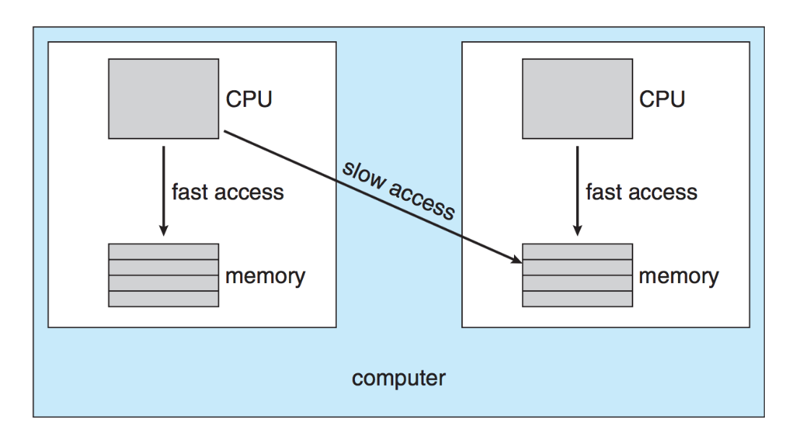
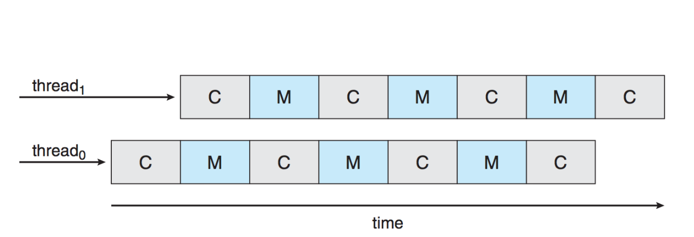
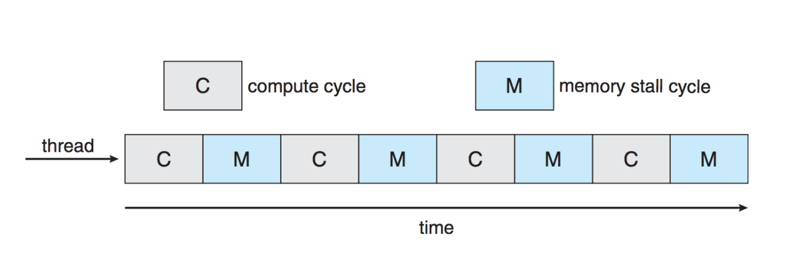

# Continuing Scheduling Algorithms

## 1. Highest Response Ratio Next (HRRN)

- Focuses on minimizing the normalized turnaround time for processes, defined as the ratio of the turnaround time (waiting time plus execution time) to the service time (execution time).
- Formula:
  $$
  R = \frac{w + s}{s}
  $$
  - \( w \): waiting time
  - \( s \): service time (estimated)
- Processes with longer waiting times and shorter service times are prioritized, ensuring even long processes eventually receive CPU time, thereby reducing starvation.

## 2. Multilevel Queue Scheduling

- Splits the ready queue into multiple queues with each process assigned to one based on attributes (e.g., priority, memory needs, foreground/background).
- Different scheduling algorithms may apply to each queue (e.g., Round Robin for the foreground, FCFS for the background).
- Requires a mechanism for choosing which queue’s processes to run next, using strategies like absolute priority or time slicing among queues.

## 3. Multilevel Queue Feedback Scheduling

- Processes may move between queues based on their CPU usage (e.g., processes that consume a lot of CPU may move to lower-priority queues).
- Example: **CTSS (Compatible Time Sharing System)**:
  - Processes start with higher priority and are moved to lower-priority queues if they exceed their time slices, creating a "ratchet" effect (they can move down but not up).

## Guaranteed Scheduling and Lottery Scheduling

1. **Guaranteed Scheduling**:
   - Each user process is promised a fair share of CPU time (e.g., with *n* users, each gets 1/*n* of CPU time).
   - Tracks actual CPU time versus the ideal allocation and schedules processes with the lowest relative usage next.

2. **Lottery Scheduling**:
   - Processes receive a number of "tickets" based on their priority.
     - CPU time is allocated randomly, with higher-priority processes receiving more tickets, increasing their chances.
   - Co-operating processes can share tickets (e.g., a client process can give tickets to a server to expedite service).
   - Offers a flexible and low-overhead approach compared to guaranteed scheduling.

## The Idle Task

- **Idle Task Behavior**:
  - When no other processes are available, the system runs the **idle task**, which may:
    - Repeatedly call the scheduler.
    - Execute no-operation (NOP) instructions or simple tasks.
    - Enter a low-power state.
  - The idle task helps with system accounting and resource utilization (e.g., reporting CPU idle time).

## Priority Inversion and Inheritance

1. **Priority Inversion**:
   - Occurs when a high-priority task is blocked by a lower-priority task holding a required resource, while medium-priority tasks continue executing.
   - Example: **Mars Pathfinder rover** experienced priority inversion, requiring a solution to restore system functionality.

2. **Priority Inheritance**:
   - Temporarily elevates the priority of a blocking low-priority task to match that of the waiting high-priority task, ensuring it completes quickly and releases the resource.

## Multiprocessor Scheduling

1. **Challenges**:
   - Scheduling multiple processors introduces significant complexity compared to single-processor systems.
   - **Multiprocessor Classifications**:
     - **Distributed**: Separate systems working independently.
     - **Functionally Specialized**: Each processor handles specific tasks.
     - **Tightly Coupled**: Processors share memory and are closely coordinated (focus of this discussion).

2. **Granularity of Tasks**:
   - The level of parallelism determines how tasks interact and are scheduled.
     - **Fine-Grained**: Involves individual instructions (<20).
     - **Medium-Grained**: Involves a single application (20-200).
     - **Coarse-Grained**: Involves multiple processes (200-2000).
     - **Very Coarse-Grained**: Distributed systems (2000-1M).

3. **Asymmetric vs. Symmetric Multiprocessing (SMP)**:
   - **Asymmetric Multiprocessing**: One "boss" processor handles scheduling and kernel tasks.
   - **Symmetric Multiprocessing**: Each processor schedules itself, requiring synchronization to avoid conflicts (e.g., accessing the same ready queue).

## Processor Affinity and Load Balancing

1. **Processor Affinity**:
   - Describes the desire for processes to stay on a specific processor due to cached data (reduces cache misses).
   - **Soft Affinity**: A process prefers a specific processor but can move.
   - **Hard Affinity**: A process is restricted to a specific processor.
   - **Non-Uniform Memory Access (NUMA)**: When the CPU can access some parts of memory faster than others
     - Choice of processor should be bases on where the memory of the process is located
     - Memory allocation routine should alo pay attention where to allocate memory requests

2. **Load Balancing**:
   - Balances the workload across multiple processors to avoid overloading one while others remain idle.
   - **Push and Pull Migration**:
     - **Push**: Periodically redistributes tasks among processors.
     - **Pull**: Processors with no tasks "steal" work from busy ones.
   - Often conflicts with processor affinity, requiring trade-offs.

## Hyperthreading and Multicore Processors

- **Hyperthreading**: Allows a single CPU core to execute two threads, reducing idle time during memory stalls by switching to another thread.
  
- **Multicore Processors**: Treats each core as a separate processor, improving parallelism and overall performance.
  - **Memory Stall**: periods of time where there is stall in computation due to cache misses
  

## Two Levels of Scheduling

1. Assigning a process or thread to a processor (job of the OS)
2. When to swap between the two threads in teh core (job of the hardware)

