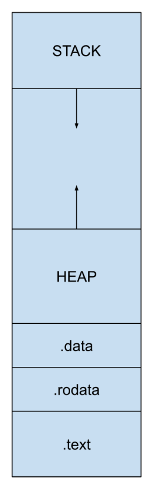

# Executable Organization

## Min Requirement for Executable

1. The `.text` section: Contains the actual executable code
2. The start symbol/address: Usually `__start()`, which calls `main()`

## Other Important Sections

- `.data`: Stores global or static variables initialized to non-zero values
- `.rodata`: Contains read-only data
- `.bss`: Reserves space for global/static variables initialized to zero

## Programs vs. Processes

- A program is your compiled code (static)
- A process is a program in execution (dynamic)

**A process consists of**:

1. Instructions and data
2. Current state
3. Resources needed for execution

**Multiple instances of the same program running simultaneously are separate processes**

## Memory Assignment and Execution

1. **Compile-time**: The compiler resolves static variables and link
2. **Load-time**: The system sets up memory segments and links shared objects
3. **Run-time**:

- Dynamic allocation is resolved
- The code is executed
- The process starts at the start symbol (usually `__start()`)

## Executable In Memory

## Execution

Once launched the program runs as intended by the programmer, unless the OS needs to intervene.
