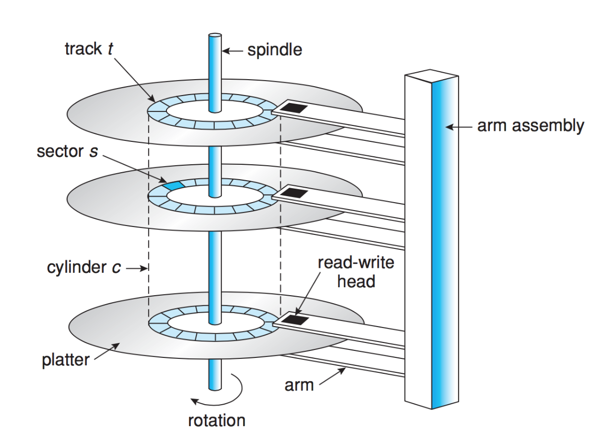
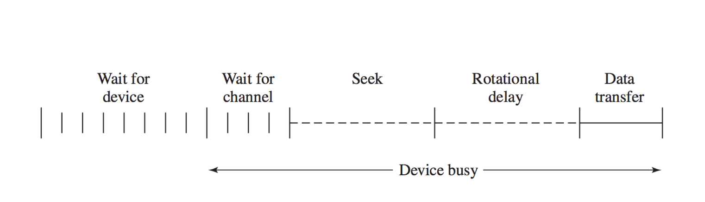

# Disk Scheduling

## Introduction to Disk Scheduling

- The disk, compared to the CPU, is a slow device, so optimizing disk operations is crucial to improve system performance.
- **Focus**: Understanding magnetic disks, their performance constraints, and algorithms designed to optimize data access.

## Magnetic Disks Overview

- If you don’t have an SSD, data storage relies on magnetic hard disks.
  - Magnetic disks involve physical movement for read/write operations, resulting in delays.
  - Efficient scheduling can help minimize these delays.

## Excluding SSDs

- **SSDs (Solid State Drives)** are excluded from the discussion:
  - SSDs have no moving parts, resulting in consistent and uniform access times, making complex scheduling algorithms unnecessary.

## Hard Drive Internals

- **Read-Write Heads**: Positioned close to disk platters and used for reading/writing data.
  - Disk heads can cause a **head crash** if they contact the platter, leading to permanent data loss.
- **Platters and Tracks**:
  - Data is organized into circular tracks divided into sectors (blocks).
  - Multiple tracks form a column.

## Disk Performance

- **Transfer Rate**: Speed at which data moves to/from the disk.
- **Random Access Time**: The time taken to access a specific piece of data, further broken down into:
  - **Seek Time**: Time to move the disk head to the desired track.
  - **Rotational Latency**: Time for the desired sector to rotate under the head.
  - Typically measured in milliseconds.

### Disk Access Time Formula

- The total average access time (\( T_a \)) for a disk operation:
  \[
  T_a = T_s + \frac{1}{2r} + \frac{b}{rN}
  \]
  - \( T_s \): Average seek time.
  - \( r \): Rotation speed (revolutions per second).
  - \( b \): Number of bytes to be transferred.
  - \( N \): Number of bytes per track.

## Performance Variance Example

- Consider a disk with:
  - **Average Seek Time**: 4 ms.
  - **Rotation Speed**: 7500 RPM.
  - **512-byte Sectors**: 500 sectors per track.
- **Sequential Data Access**:
  - Sequential file storage allows efficient reading due to minimal additional seek time.
  - Total access time example: 64 ms for reading a file stored across 5 adjacent tracks.
- **Random Data Access**:
  - Randomly distributed sectors result in significant delays, up to 20 seconds for 1.28 MB.

## Disk Scheduling Algorithms

### 1. Random Scheduling

- A baseline with no organization, purely comparing disk access performance.

### 2. First-Come, First-Served (FCFS)

- Processes disk requests in the order received.
- **Advantages**: Simple and fair.
- **Disadvantages**: Poor performance due to lack of optimization for seek time.

### 3. Shortest Seek Time First (SSTF)

- Selects the request with the shortest seek time from the current head position.
- **Advantages**: Reduces seek time compared to FCFS.
- **Disadvantages**: Prone to **starvation**, as requests near the head can cause distant requests to wait indefinitely.

### 4. SCAN Scheduling (Elevator Algorithm)

- Disk head moves in one direction, fulfilling requests, then reverses direction when it reaches the end.
- **Pros**: Prevents starvation.
- **Cons**: May lead to delayed access if multiple requests are just beyond the current position.

### 5. C-SCAN (Circular SCAN)

- Head moves in one direction to the end and then jumps back to the start without servicing requests during the return.
- **Advantage**: Provides a more uniform wait time compared to SCAN.

### 6. LOOK and C-LOOK

- Optimizations of SCAN and C-SCAN:
  - The head moves only as far as the last request in the current direction before reversing or jumping.

## Additional Considerations

- **Bandwidth**: Total bytes transferred divided by the time taken to complete the request.
- **Queueing Strategy Modifications**:
  - Double buffering with SCAN-like algorithms to ensure fairness and prevent starvation.

## OS Role in Disk Scheduling

- While disk controllers can handle basic scheduling, the OS may need to intervene, especially in scenarios involving higher-priority tasks or real-time requirements.
