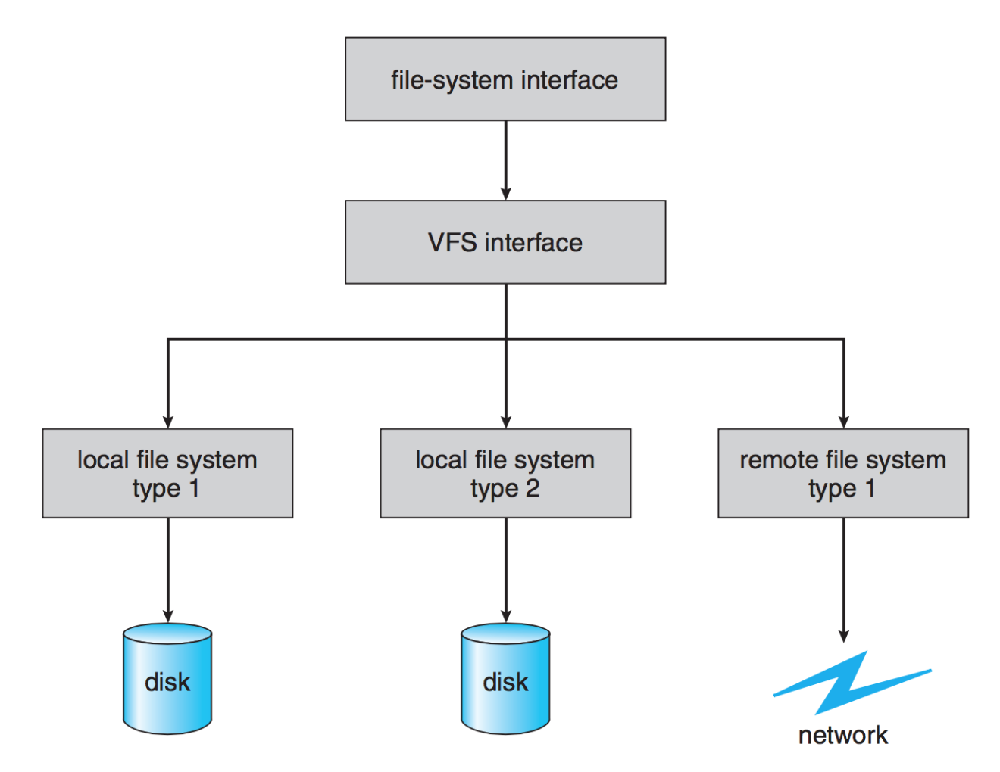
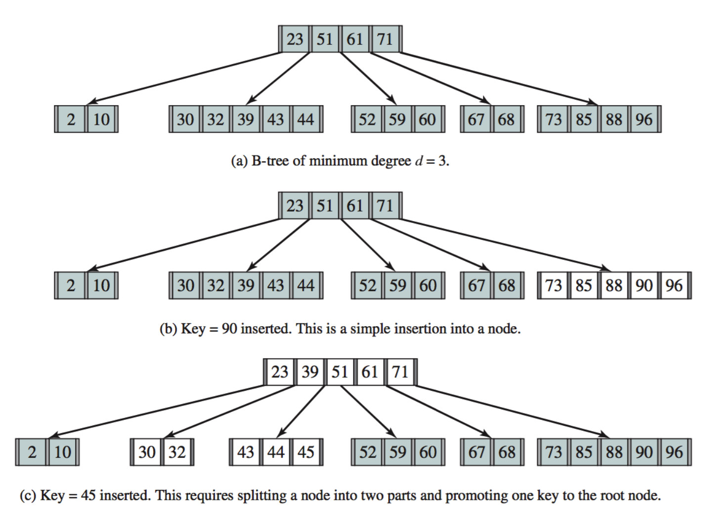

# File System Implementation

## Implementing the Interface

- Focus on the underlying implementation of file systems for hard disks.
  - **Hard Disk Benefits**:
    - Sufficiently large and inexpensive for data storage.
    - Allow reading and writing to any part of the disk multiple times.
  - **Block Operations**:
    - Disks operate on blocks, which are composed of one or more sectors.

## Layers of File System Design

1. **Logical File System**
2. **File Organization Module**
3. **Basic File System**
4. **I/O Control**

## Disk Organization

- **File Systems**: There are many different file systems (e.g., UFS, HFS+, ZFS, NTFS, ext3, FAT32) with distinct structures but shared principles:
  - Track total blocks, free block locations, directory structure, and file data.
- **Boot Information**:
  - Some disks contain boot data for starting the OS (typically in the first block, with BIOS control handed over to this boot loader).

## Disk Partitioning

- **Partitions**: Logical division of disks into areas or partitions.
  - **Windows Example**: Typically has one partition for the primary disk (e.g., C: drive).
  - **Linux Example**: Often uses multiple partitions (e.g., swap, home directories, boot).

## Caching in File Systems

- Structures commonly cached for performance:
  1. **Mount Table**
  2. **Cache**
  3. **Global Open File Table**
  4. **Process Open File Table**
  5. **Buffers**

## File Control Block (FCB)

- **Creation**: The logical file system creates new files and allocates FCBs (or reuses free FCBs).
- **Opening a File**:
  - When a user or application opens a file, the system call checks if the file is already open using the global open file table.
  - If exclusive access is required and the file is already open, an error is returned.
  - For non-exclusive access, a reference is added to the process open file table without retrieving the file again.
  - If not open, the FCB is copied into the global table and referenced.

## Closing a File

- Upon closing a file:
  - The entry is removed from the open file table.
  - If it is the last reference, it is removed from the global table, and metadata may be updated.

## Metadata Maintenance

- **Spotlight Example (macOS)**: Rapid system-wide desktop search based on metadata.
  - Updates metadata upon file creation or modification for fast indexing and queries.

## Virtual File System (VFS)

- Provides abstraction for different file systems to appear identical to users.
  - **Primary Purposes**:
    1. Separates file system operations (e.g., reading, writing, opening, closing) from implementation.
    2. Represents files uniquely across a network using vnodes (similar to inodes but unique within a file system).
  - **VFS Objects**:
    1. **inode**: Represents an individual file.
    2. **file**: Represents an open file.
    3. **superblock**: Represents the file system.
    4. **dentry**: Represents a directory entry.

## Directory Implementation

- **Linear List**: Simplest approach; slow for large directories due to linear search times.
- **Hash Table**: Faster lookups but requires strategies for handling collisions.
- **Tree Structures (B-Trees)**:
  - **B-Trees**:
    - Nodes contain multiple keys, with keys stored in a non-decreasing order.
    - Nodes may split when full, maintaining balance for consistent lookup times.

### B-Tree Operations

1. **Insertion**:
   - Search for the key's location.
   - If the node is full, split it around the median key and promote the median to the parent.
   - If the root node splits, the tree height increases.
2. **Searching**:
   - Start at the root node.
   - Traverse to the correct node based on key comparisons.
3. **Properties**:
   - All leaves appear at the same level.
   - Nodes contain at least \(d-1\) keys and at most \(2d-1\) keys (for a given degree \(d\)).

