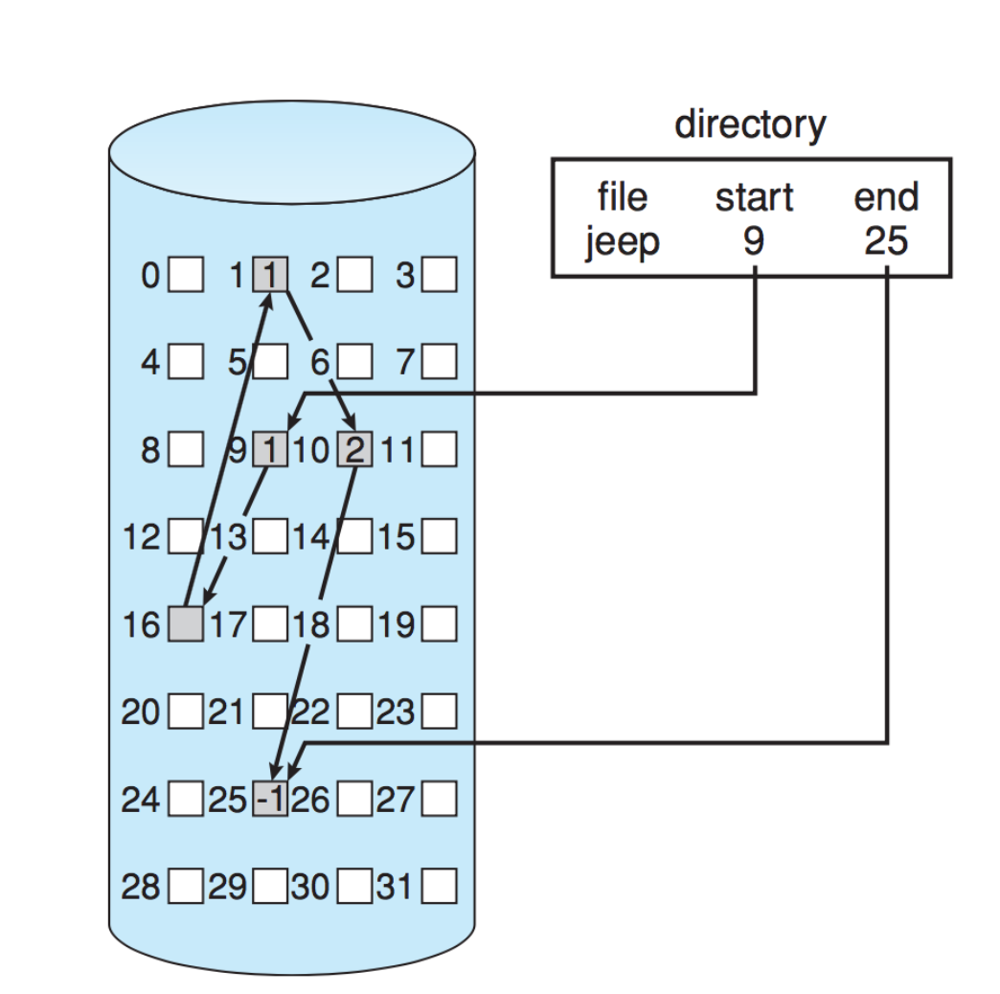
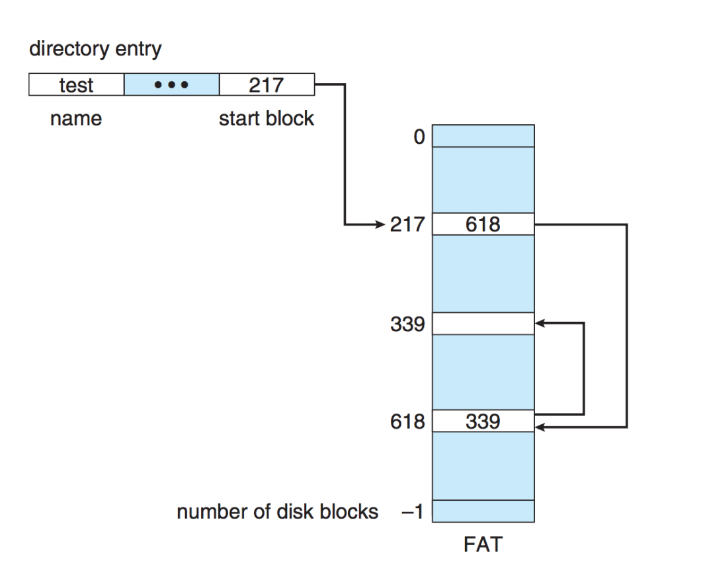
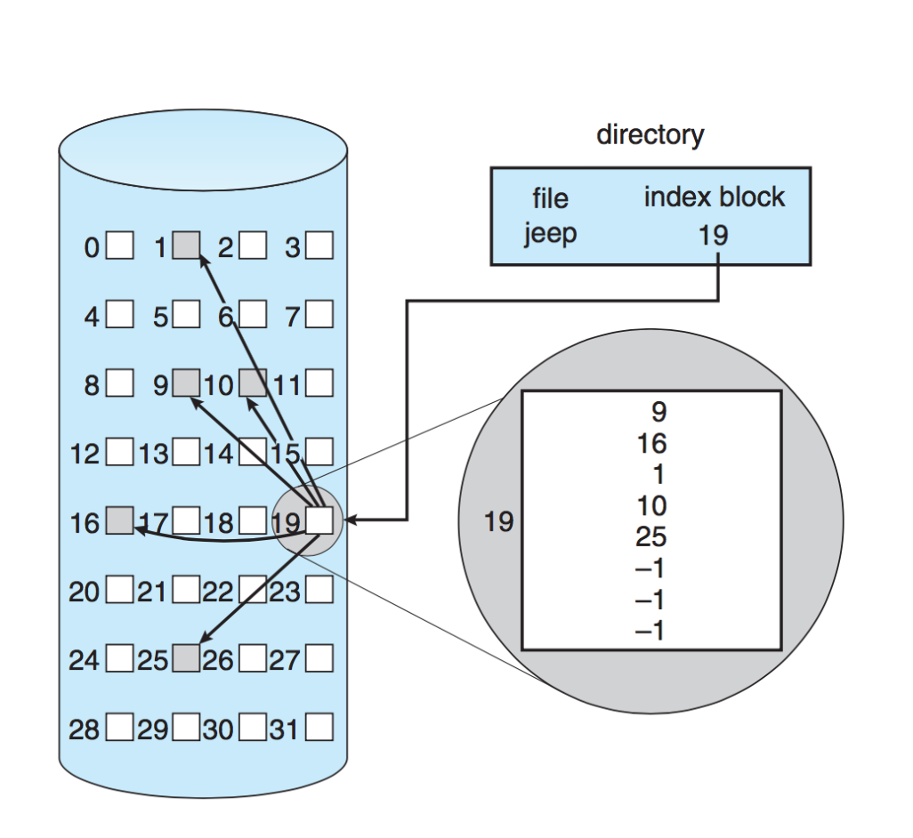
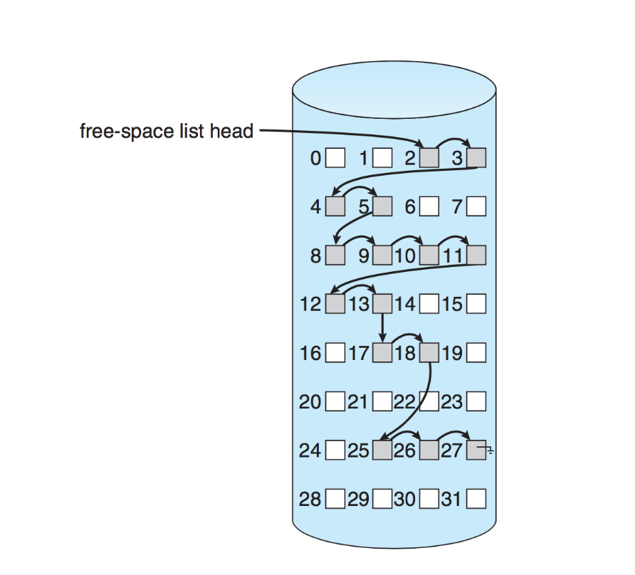
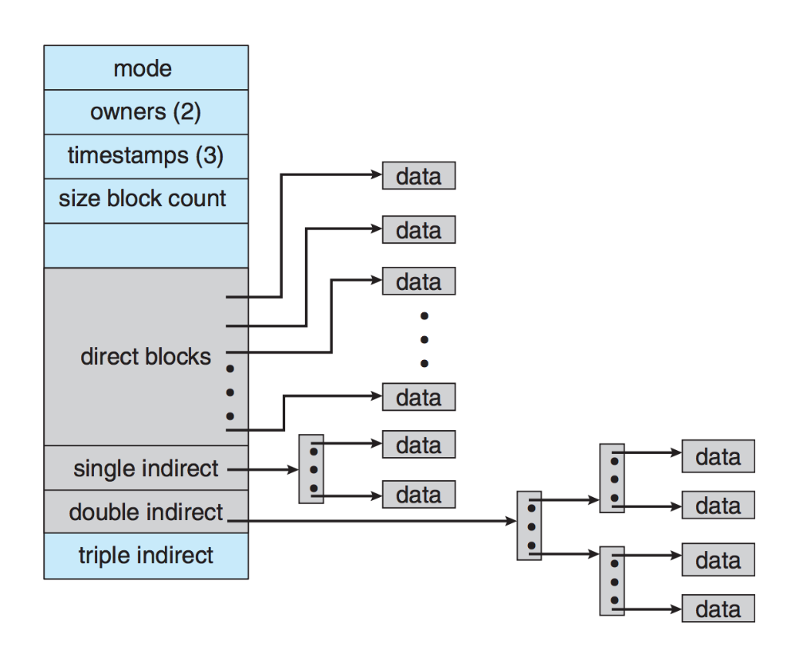
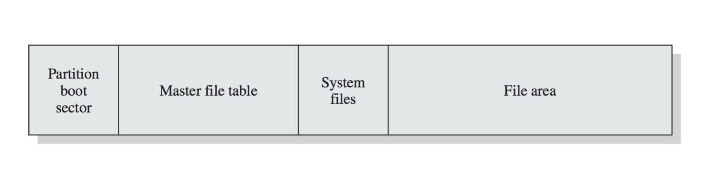

# File Allocation Methods

## Overview of Disk Space Allocation

- There are three major strategies for allocating disk space to files:
  - **Contiguous Allocation**
  - **Linked Allocation**
  - **Indexed Allocation**
- Each strategy has its own advantages and disadvantages.

## Contiguous Allocation

- **Description**: A file occupies a set of contiguous blocks on disk. If a file starts at block \( b \) and is \( n \) blocks in size, it occupies blocks \( b, b+1, b+2, \ldots, b+(n-1) \).
- **Advantages**:
  - Minimal or nonexistent seek time since accessing subsequent blocks requires no head movement.
  - Sequential and direct access are straightforward: the first block of a file is at position \( b \), and accessing any block \( i \) within the file is computed as \( b + i \).
  - Easy to check if access is valid by verifying if \( i < n \).
- **Problems**:
  - **Memory Allocation Problem**: Finding a contiguous block of size \( N \).
    - Which block to choose if multiple blocks are available?
    - Suffer from **external fragmentation** and minor **internal fragmentation** in the last block.
- **Compaction**:
  - Moving allocations around in memory to create larger free spaces for future allocations.
  - Disk compaction is possible but slow and computationally expensive. Typically performed when the system is idle or minimally disruptive.

## Linked Allocation

- **Description**: Uses a linked list of blocks. The blocks themselves can be located anywhere on the disk.
  - The directory listing contains a pointer to the first and last blocks (head and tail).
- **Advantages**:
  - Solves the problem of contiguous allocation by allowing file blocks to be scattered.
  - Compaction and relocation are unnecessary.
- **Disadvantages**:
  - Accessing block \( i \) is inefficient, requiring following multiple pointers.
  - **Solution**: Group blocks into clusters (e.g., four blocks) to reduce memory overhead and improve access times.

### File Allocation Table (FAT)

- **Description**: A variation of linked allocation used primarily in earlier versions of Windows (e.g., FAT32).
  - A table at the beginning of the disk maintains file allocation data.
  - Each table entry corresponds to a block and contains the index of the next block.
  - The directory entry contains the first block of the file, and the table entry for that block points to the next block, continuing until the end-of-file value is reached.
- **Optimization**: The FAT should be cached in memory to minimize disk access delays.

## Indexed Allocation

- **Description**: All pointers to file blocks are placed in a single location called an **index block**.
  - Allows for efficient access by directly looking up the index for a given block \( i \).
- **Block Size Considerations**:
  - Large files may require multiple index blocks.
  - Solutions include:
    1. **Linked Scheme**: Linking multiple index blocks.
    2. **Multilevel Index**: Creating a hierarchy of index blocks (similar to a tree structure).
    3. **Combined Scheme**: Combining both linked and multilevel approaches.

## Free Space Management

- **Bit Vectors**: Use a bit to represent each block (1 for free, 0 for allocated).
  - **Drawback**: Large disks require more overhead to store bit vectors.
- **Linked List**: Use a linked list where the head points to the first free block, and subsequent blocks are linked.
- **Grouping**:
  - The first free block stores the addresses of \( n \) free blocks, with the last block containing another set of \( n \) free blocks.
  - Enables quicker allocation of large numbers of free blocks.
- **Counting**:
  - Stores the address and count of free contiguous blocks (e.g., (27, 4) for blocks 27-30).
  - Entries can be stored in balanced trees for efficient access.

## Preallocation

- **Example**: UNIX inodes are preallocated, ensuring even empty disks have inodes reserved.
  - Improves file system performance by keeping file data near the inode to reduce seek time.

## Consistency Checking and Journalling

- **Consistency Checking**:
  - Detects and repairs inconsistent states (e.g., mismatches between file size and actual blocks).
  - Examples: UNIX uses `fsck`, Windows uses `chkdsk`.
- **Atomic Operations**:
  - Ensures operations either complete fully or do not occur at all.
  - Used in systems like Windows NTFS and Mac OS HFS+.
- **Transactions**:
  - All metadata changes are logged, with entries carried out in the order they appear in the log.
  - If a crash occurs, the log provides a record for completing or undoing partially completed transactions.

## Example: NTFS (Windows File System)

- **Storage Levels**:
  1. **Sector**
  2. **Cluster**: Fundamental unit of allocation.
  3. **Volume**: Contains file system information, files, and free space.
- **Master File Table (MFT)**:
  - Contains information about all files and folders.
- **Journalling**:
  - Maintains a consistent state of metadata using log files.

