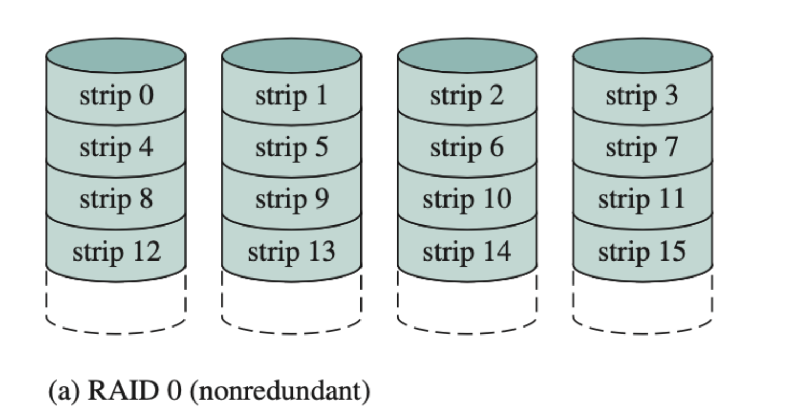
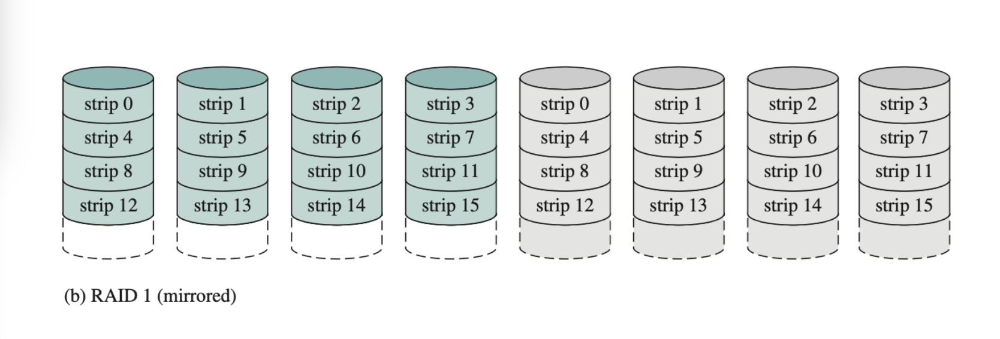
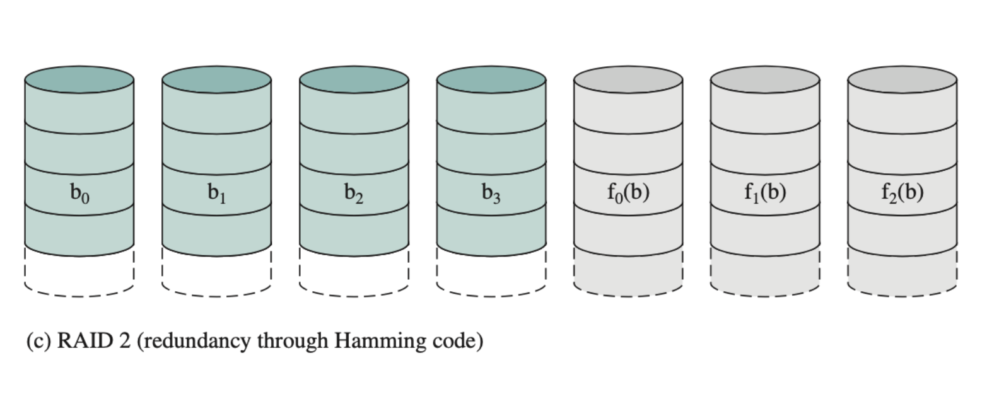
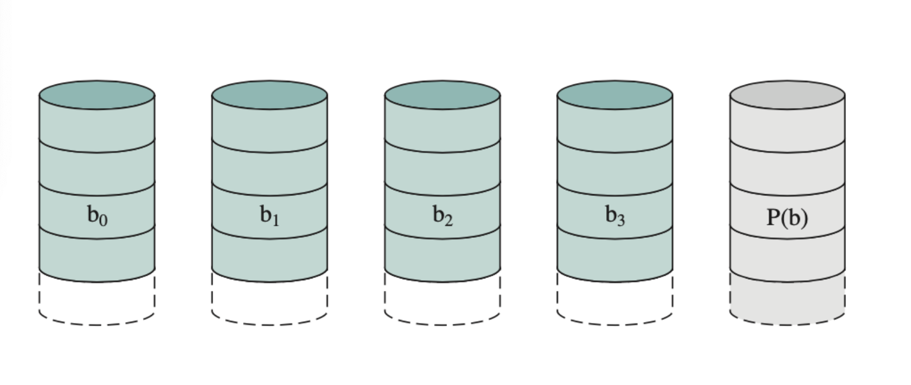
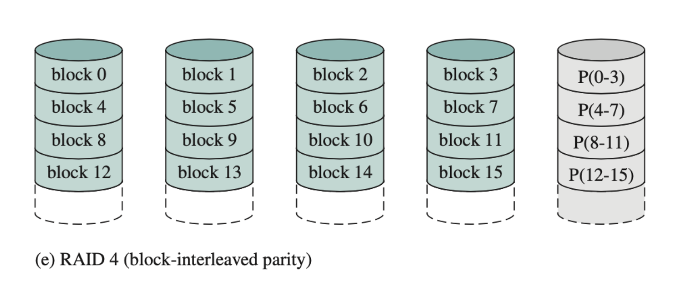
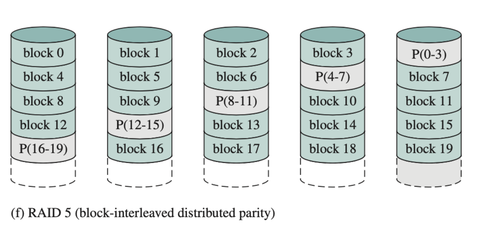
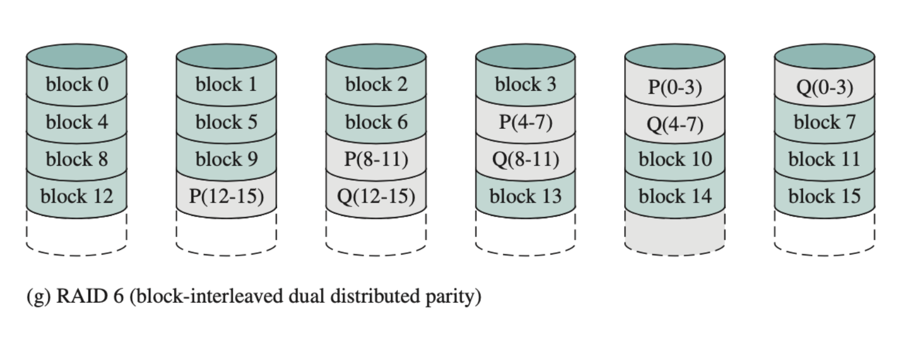
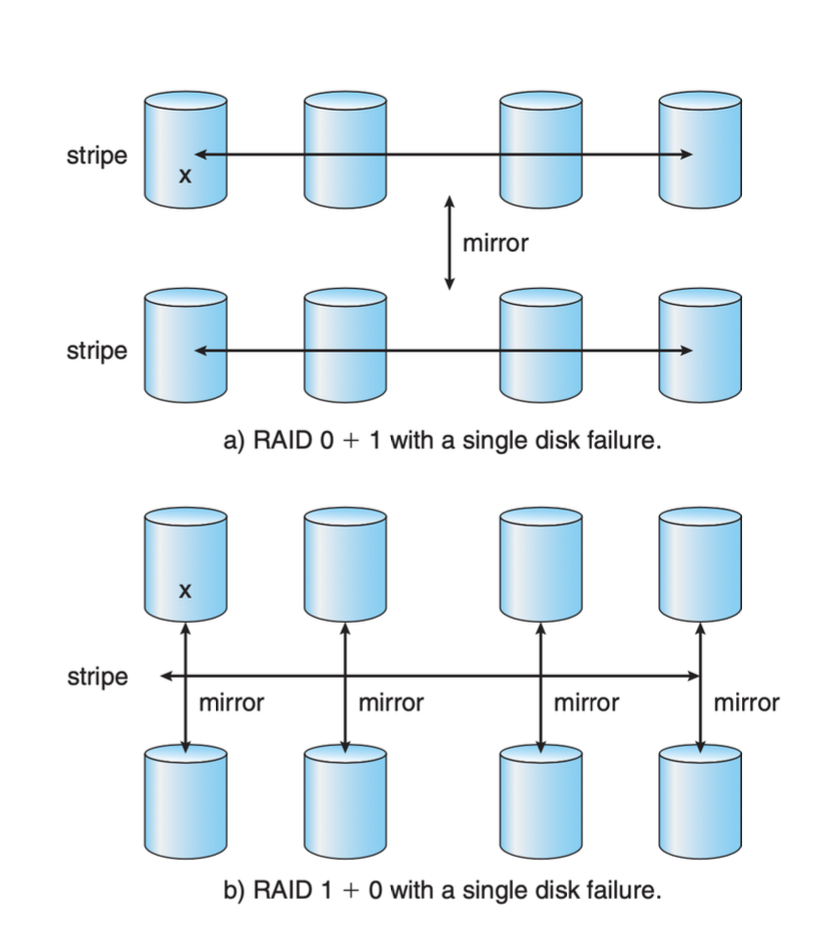

# Reliability and RAID

## Introduction to Reliability

- **Failure is Always an Option**: Hard drives can fail, leading to potential data loss, system downtime, or reduced performance.
- **Backups**: While useful, backups may not always be up to date and may not guarantee a quick recovery or ensure reliability in every scenario.

## RAID Overview

- **RAID (Redundant Array of Independent Disks)**: Combines multiple independent disks to appear as a single logical drive/volume, enhancing reliability, availability, and sometimes performance.
  - RAID can be managed through software or hardware.
  - **Redundancy**: Determines how much data protection is needed based on the impact of potential data loss (e.g., inconvenience, business-critical loss, uptime requirements).

## Mean Time to Failure (MTTF)

- **Definition**: The average operational time before a device fails. Always an estimate.
  - Example: If a single disk has an MTTF of 100,000 hours (~11.4 years), a data center with 100 such disks has a combined MTTF of 1,000 hours (~41.66 days).

## Improving Reliability

- **Cost of Redundancy**: Comes at the expense of additional hardware (more disks) or reduced usable capacity. Reliability requires trade-offs in cost and capacity.
- **Mirroring**: The simplest form of redundancy where data is duplicated on two disks.
  - If one disk fails, data is still accessible from the mirrored disk.

### Mean Time to Data Loss (MTTDL) for Mirroring

- Example: With an MTTF of 100,000 hours and a mean time to repair (MTTR) of 10 hours, the MTTDL is calculated as:
  \[
  \text{MTTDL} = \frac{(100,000)^2}{2 \times 10} = 500 \times 10^6 \text{ hours} \approx 57,000 \text{ years}
  \]
- Highlights the significant reliability increase from simple mirroring.

## RAID Levels Overview

- RAID configurations are described as "levels," each with distinct features and trade-offs. Higher numbers do not always imply better performance or reliability.

### RAID Levels

1. **RAID 0 (Disk Striping)**:
   - **Description**: Splits data across multiple disks to increase performance.
   - **Redundancy**: None; if one disk fails, all data is lost.
   - **Use Cases**: Performance-focused applications where data loss is acceptable.

2. **RAID 1 (Mirroring)**:
   - **Description**: Duplicates data across two disks.
   - **Redundancy**: High; data remains available if one disk fails.
   - **Trade-Offs**: Increased cost due to 100% redundancy.

3. **RAID 2**:
   - **Description**: Uses bit-level striping with a dedicated Hamming code for error correction.
   - **Popularity**: Rarely used in practice.

4. **RAID 3 (Byte Parity)**:
   - **Description**: Byte-level striping with a dedicated parity disk for error correction.
   - **Popularity**: Rarely used; similar to RAID 4.

5. **RAID 4 (Block Parity)**:
   - **Description**: Block-level striping with a dedicated parity disk.
   - **Disadvantage**: The dedicated parity disk can become a bottleneck.

6. **RAID 5 (Distributed Block Parity)**:
   - **Description**: Similar to RAID 4 but distributes parity across all disks.
   - **Redundancy**: Can withstand one disk failure.
   - **Performance**: Better write performance than RAID 4 due to distributed parity.

7. **RAID 6**:
   - **Description**: Extends RAID 5 by adding an additional parity block, allowing for two simultaneous disk failures.
   - **Redundancy**: Higher fault tolerance but more complex and slower writes.

### Combining RAID Levels

- RAID levels can be combined to provide a balance of redundancy and performance, such as RAID 01, RAID 10, and RAID 50.
  - **Example**: RAID 10 (1+0) offers striping for performance and mirroring for redundancy.

## Choosing the Right RAID Level

- Considerations:
  1. **Data Criticality**: How important is it to prevent data loss?
  2. **Budget**: How much are you willing to spend on redundancy and performance?
  3. **Performance Requirements**: Is performance a key factor?
  4. **Failure Handling**: Can the system continue operating if a disk fails?
  5. **Rebuild Times**: How critical are recovery times after a failure?

- **No One-Size-Fits-All Solution**: The choice of RAID level depends on specific needs and trade-offs between performance, cost, redundancy, and complexity.
