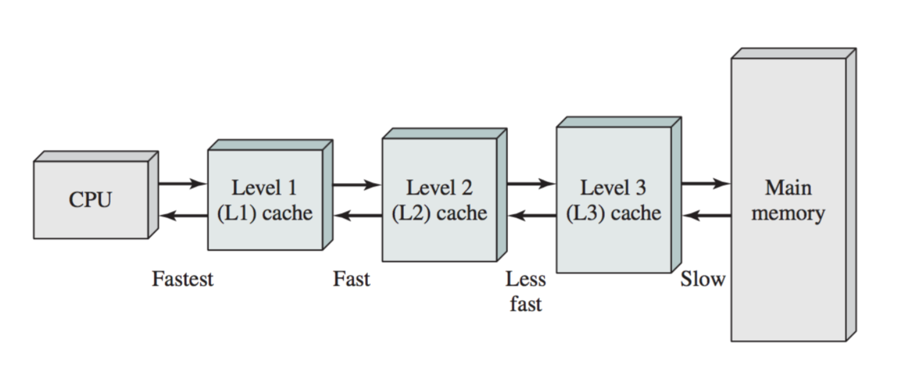

# Computer Organization

A computer program consists of instructions and data. To execute a program, we need three main components:

1. Main Memory
2. System Bus
3. Processor (CPU)

## Main Memory

Memory in computers is organized in a hierarchy:

* Fastest and smallest: Registers
* Fast and small: Cache (often multiple levels: L1, L2, L3)
* Larger and slower: Main Memory (RAM)
* Largest but slowest: (SSH, HDD)

The goal is to balance speed, size and cost.

**Iron Triangle**: Fast, Good, Cheap; Pick Two

## System Bus

This is the communication pathway between components. Modern systems have multiple busses for different purposes:

1. Data (memory)
2. Address (select for read/write)
3. Instruction
4. System (peripherals)

## Central Processing Unit (CPU)

The CPU is the brain of the computer. It operates in a cycle:

1. Fetch Instructions
2. Decode Instructions
3. Execute Instructions

This cycle repeats until the program finishes

### Pipelining

* Different stages of the cycle can be executed in parallel
* Improves the efficiency by allowing multiple instructions to be processes simultaneously
* **Example**: While one instruction is being executed, the next can be decoded and a third can be fetched

### Word Size

* The largest unit of data the CPU can process in one operation
* 32-bit computers work with 32-bit word, 64-bit with 64-bit words etc.
* Affects memory addressing, data processing capabilities, and overall system performance

### Registers

* Fast storage locations within the CPU
* May store data or instructions

**Important Registers**:

* Program Counter
* Status Register
* Instruction Register
* Stack Pointer
* General Purpose Registers

In many programs the compiler is responsible for register assignment.

### Instruction Set

* CPU-specific instructions, some only available in supervisor mode (sudo)

## ARM Cortex M4 Specifics

### Flash Memory Access

The Cortex M4 has some specific features related to instruction fetching:

* It can fetch multiple instructions at once (4-8)
* The instruction bus is 128 bits wide
* Accessing flash memory requires wait states, which can waste CPU cycles

### Branch Cache

The STM32F401RE (a Cortex M4 based microcontroller) has a branch cache to help with instruction pre-fetching.

### Cache Specifications

* Has 13 general-purpose registers (r0-r12)
* Stack Pointer (okay, 2)
* Link Register
* Program Counter
* xPSR (Operating Mode)

## Caching

Caching is critical for improving performance. It works by storing frequently used data in faster memory (not main memory).

**Cache vs. CPU Data Operation**:

* Caches can operate on data of any size, CPUs operate on blocks of fixed size (words)

**Line**: An entry in a cache

* Assume that a cache line always corresponds to a fixed-size block of memory

**Cache Hit**: Data found in cache
**Cache Miss**: Data not found in cache

### Effective Access Time

The effectiveness of a cache is measured by it's hit ratio. The effective access time can be computed as:

```math
Effective Access Time = h * $t_c$ + (1-h) * $t_m$
```

Where:
h: hit ratio
t<sub>c</sub>: time to load a block from cache
t<sub>m</sub>: time to lead a block from memory

We want the hit ratio to be as high as possible and effective access time to be as small as possible.

### Multiple Levels of Cache

Multiple levels of the cache (L1, L2, L3) are common in modern CPUs.



* **L1**: Smallest and fastest
* **L3**: Largest and slowest

## Memory Management

* Memory is divided into blocks or lines
* When a cache miss occurs, a replacement algorithm decides which cache line to evict
* Temporal and spacial locality principles guide efficient cache usage

### Replacement Algorithms

**Example**:

We are trying to fetch data and miss in the L1 cache, so the following steps are performed:

1. L2 cache checked
2. If L2 cache contains the desired block
  - Copy data to L1 cache
  - Data is then sent to CPU
3. If not in L2 cache, L3 is checked
4. If not in any cache it is in main memory and will be retrieved from there, copied in-between levels on it's way to the CPU

This example is where `Block Replacement Algorithms` arise

To make smart decisions about what sort of strategy to choose, we need to know a few things about how dat is accessed in a system.

Here's some patterns about usage:

1. **90/10 rule**:
  - The 90/10 rule, in the context of computer memory access, states that approximately 90% of a program's execution time is spent on about 10% of the code.

2. **The principle of temporal locality**:
  - Temporal locality refers to the tendency of a program to access the same memory locations repeatedly within a short period of time. 

3. **The principle of spacial locality**:
  - Spatial locality is the tendency of a program to access memory locations that are near those that have been recently accessed.

## Memory Mapping

In microcontrollers like the Cortex M4, different types of memory and I/O are mapped to specific address ranges. This allows unified access through pointers but limits the maximum size of each memory type.