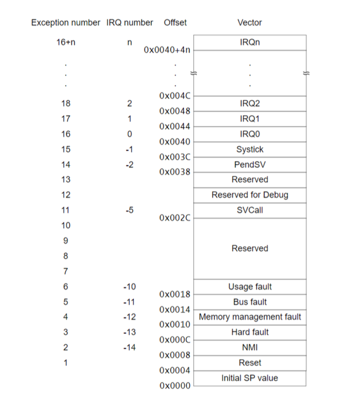
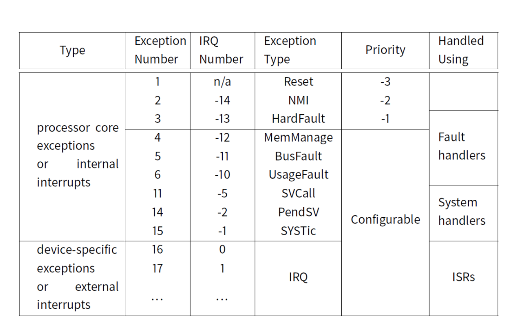

# Interrupt Implementation

## Recap of Interrupt Basics

* Allow CPU to stop its current task and respond to an external event
* This avoids polling, where CPU would waste time checking for events continuously

**Example**: Instead of the CPU constantly checking if a sensor has data, it can do other tasks and handle the sensor data only when interrupted

## Interrupt Flow

1. Interrupt occurs
2. CPU Saves State
3. Interrupt Handled
4. Resume original task (unless its a hard fault)

## Handling Interrupts

**Interrupt Requests (IRQ)**: Signals the CPU that an interrupt is ready to be handled. The signal is a physical voltage change

* **Interrupt Line**: Each interrupt has a dedicated line or wire

**Interrupt Vector Table**:

* Array of function pointers that map interrupts to specific memory addresses
* Cortex M4 starts this table at address `0x0`
* These are often pre-configured in the setup code and rarely need manual config

**Example**: You won't need to write an interrupt handler from scratch.
  
* Pre-made function names are used

## Efficiency and Best Practices

* **Keep Interrupt Service Routines ISRs Short**: ISRs should be minimal and fast for several reasons:

  1. Return to normal operation quickly
  2. Minimize delay for other interrupts
  3. Less code means fewer bugs
  4. Assembly code is hard; focus on keeping logic in simpler C functions

**Example** A SysTick interrupt routine that only updates a counter instead of handling complex logic

* **Reentrant Functions**: Functions called within and ISR should be reentrant, meaning they do not rely on shared global/static variables
  * **Non-Reentrant Example**: A swap function using a global tmp variable would fail if two ISRs call it simultaneously
  * **Fix**: Use local variables instead of shared ones to ensure thread safety

## Interrupt Priorities

* **Priority System**: Lower numbers indicated higher priority interrupts. In Cortex M4, some interrupts (e.g. Non-Maskable Interrupts - NMIs) always have the highest priority and cannot be changed
* **Nested Interrupts**: Some system can handle one interrupt while another is running

## Interrupt Masking

* **Maskable Interrupts (IRQs)**: These can be temporarily disabled or ignored based on the system needs (non-critical)
  * **Example**: A timer interrupt might be disabled when a critical real-time tasks are running
* **Non Maskable Interrupts (NIMs): Cannot be turned off and handle critical events such as hard fault failures
  * **Example**: The CPU halts for NMI, ensuring immediate attention t critical issues

## Interrupt States

Interrupts can be in several states:

1. **Pending**: Interrupt conditions met, but ISR not yet run
2. **Active**: ISR is running
3. **Pending & Active**: Next interrupt is pending while current one is being handled
4. **Inactive**: No interrupt pending or active

**Example**: If multiple interrupts occur close together, some might be pending while other are actively being processed, creating a potential delay in response

## Global Interrupt Enable

* A single setting enable or disables all interrupts. If interrupts are disabled, they go into pending state and will be processed when re-enables
  * **Does not apply to NIMs**

## Return from Interrupt (RTI Instruction)

* A special instruction `rti` (Return From Interrupt) is used to resume the original task after handling an interrupt
* Normal return statements do not work here due to the complexity of saving and restoring CPU states

## Final Concepts

* **Efficiency Consideration**: When hardware interrupts occur, the ISR might only need to notify a user program to proceed. Writing simple ISRs minimizes system delay and complexity