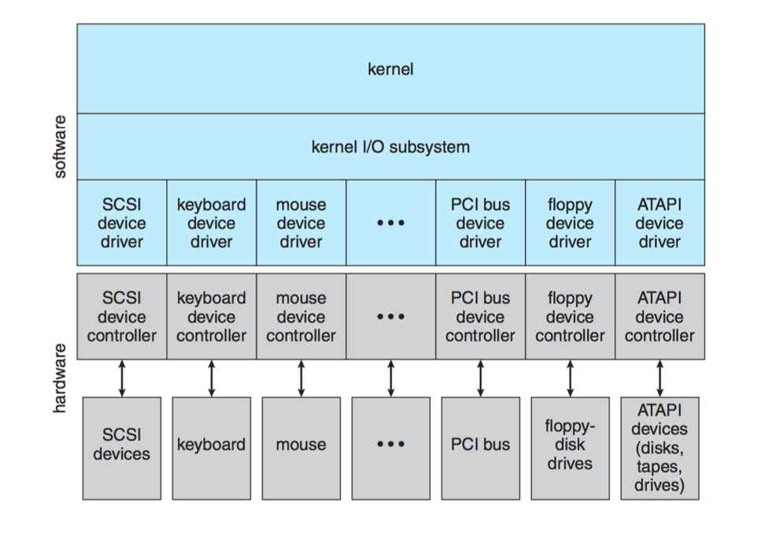

# Lecture 6 — Input/Output Devices & Drivers

## Importance of I/O

* **I/O Significance**: Although computers are often associated with computation, **input/output (I/O)** is crucial for their usefulness so they can communicate with other devices

* **I/O Complexity**: There are relatively few CPU types, but there are countless I/O devices, each functioning differently (e.g. keyboard, monitor, headsets)
  * This means that different devices have different communication protocols

## I/O Device Types and Communication

* **I/O Device Rates**: Each I/O device communicates at different speeds and in different ways
* **Communication Protocols**:
  1. **Polling**: CPU continuously checks for the device status
  2. **Interrupts**: CPU receives a signal (interrupt request) and stops its current task to address the device
  3. **DMA (Direct Memory Access)**: Transfers data directly between devices and shared memory without much CPU intervention improving efficiency
    * Example: Used for high-speed data transfer without overloading the CPU

## I/O Interfaces and Abstraction

* **Application I/O Interface**: A general-purpose OS allows devices to be added without needing to modify or recompile system. This abstraction keeps the hardware details hidden from the OS.
  * Example: Object-oriented programming is similar in the way it abstracts complexity
* **Device Drivers**: These are crucial for translating command between OS and hardware device
  * Example: Windows drivers connect at the kernel leven and poorly written drivers can lead to system crashes (Blue Screen of Death)
  * **Driver Safety**: Microsoft introduced **static driver verifier** to ensure drivers behave correctly

## Block and Character I/O

* **Block Devices**: Devices like hard drives use block-oriented operations (read, write, seek)
* The OS typically issues commands at the block level, abstracting lower level communication
  * **Example**: A memory-managed file can be treated as a simple memory access, while the OS coordinates block level operations in the background

* **Character Devices**: Devices like keyboards are character-oriented, with system calls like a `get` and `put` for smaller, unpredictable inputs
  * **Example** Printers and sound output also operate in a similar way as a linear stream of bytes

## Network Devices and Spooling

* **Network Devices**: These differ from directly attached devices and use a socket-based model (e.g. in UNIX and windows)
  * **Example**: The `select` function in sockets allows the system to manage multiple clients without polling
* **Spooling**: A method for devices like printers that can only handle one task at a time.
  * The OS buffers jobs and manages them in order
  * **Example**: Printing a job needs to be completed before the next job can start. THe spooler ensures proper job management.

## I/O Protection and Safety

* **Kernel Mode and User Mode**: User interactions with I/O are managed with the OS to ensure safety and prevent unauthorized actions
  * **Example**: Prevents the programs from canceling others' I/O requests to prioritize their own
* **Tradeoff**: Increased safety via I/O protection may come at the code of performance.