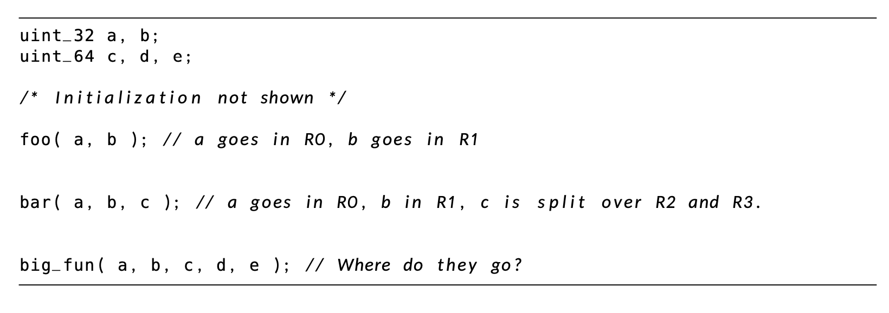
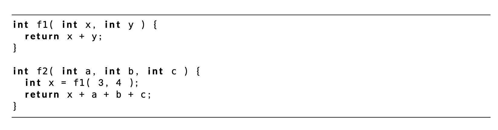

# Intro to Stack Management

**Purpose**: Managing the stack is a challenging but essential concept for efficient memory and function handling. The goal is to understand how the stack is utilized by the Cortex M4's stack pointers and follow the **Application Binary Interface (ABI)**

## What is Stored on the Stack?

1. **Local Variables**: Variables defined within a function are stored here
2. Context Variables: These include **function arguments**, **return addresses**, and the **state of the CPU at the time of the function call**.
3. **Register Data**: Information saved during function calls, such as CPU registers

## Stack Behaviour (LIFO)

* The stack operates in a **Last-In, First-Out (LIFO)** manner
  * **Push**: Add data to the top of the stack
  * **Pop**: Remove the topmost item from the stack
* **Restriction**: Directly removing elements from the middle of the stack is not allowed (though possible with unsafe memory operations, which should be avoided)

## Function Call and Stack Operations

* A typical function call involves pushing the **return address** onto the stack but not necessarily pushing all variables

Example:

```c
int do_something(int x) {
  if (x > 30) {
    int y = 5;
    return y + x;
  }
  return x - 10;
}
```

* **Steps for** `X > 30`:

1. Push return addresses
2. Push local variable `y`
3. Perform addition `y + x`
4. Pop `y`
5. Jump to the return address

* **Steps for** `x <= 30`:

1. Compute `x - 10`
2. Jump to return address

The compiler often optimizes this process by skipping unnecessary operations (e.g. directly loading values into a register without explicitly storing them on the stack)

## Balancing Push and Pop Operations

* The number of **push** and **pop** operations should always match to avoid memory leaks
  * **Overflow Risk**: If the stack grows too large, it can run out of space, causing a **stack overflow**

## Stack Growth

* **Stack Growth Direction**: In many systems, stacks grow **downwards** in memory, meaning the stack pointer (SP) is decremented when new data is added (push), and incremented when data is removed (pop)
  * **Empty Stack**: On a push the data is written and the SP is decremented
  * **Full Stack**: On a push, the SP is decremented first, then the data is written

## Cortex M4 Stack Organization

* **SP (Stack Pointer)**: Primary register used by the processor to access the stack
* **MSP (Main Stack Pointer): Always used for interrupts and is initialized via the reset vector at address `0x0`
* **PSP (Process Stack Pointer): Used by the user program and never in interrupts
* **SP in Privileged Code**: Privileged code uses MSP; PSP is reversed for unprivileged operations
  * MSP used in privileged mode
  * PSP is used in unprivileged mode

### Privileged vs. Unprivileged Code

* **Privileged Code**: Code that has full access to the system resources, including hardware peripherals and memory
  * It can access critical system areas, such as the interrupt service routines (ISRs) and system control registers
* **Unprivileged Code**: Code that is restricted from accessing certain system resources
  * Typically, user-mode applications run in unprivileged mode to prevent accidental or malicious modification of system-critical dat

### Diagram Overiview
 
```text
System Start
     ↓
System-Level Code (Privileged Mode, uses MSP)
     ↓
Start User Task (Unprivileged Mode, uses PSP)
     ↓
**Interrupt occurs**
     ↓
Switch to Privileged Mode (Switch to MSP)
     ↓
Handle Interrupt
     ↓
Return to User Task (Switch to PSP)
     ↓
Continue Execution
```

## Main Duties of the Stack

1. local vars: provided compiler does not make it a const
2. context vars: function args, return addresses
3. Register data or other state storage

## Application Binary Interface (ABI)

* **Stack Rules**: The ABI defines that the stack must be **full and descending**
  * This structure ensures consistency across compilers and architectures

## Argument Passing via Registers

* The **first four arguments** to a function are passed via registers **R0 through R3**
  * Each register holds 4 bytes (e.g., a `uint32_t` fits exactly)
  * If an argument is larger than 4 bytes (e.g. a `uint64_t`), it may occupy multiple registers

* **Example**:
  * `foo(a, b)` -> `a` in R0, `b` in R1
  * `bar(a, b, c)` -> `a` in R0, `b` in R`, `c` split across R2 and R3

* **Extra Arguments**: If more than four arguments are passed to a function, the additional ones are placed on the stack



## Chained Function Calls

* In chained function calls, where one function calls another, the compiler must handle register preservation

**Example**:

```c
int f1(int x, int y) { return x + y; }

int f2(int a, int b, int c) {
  int x = f1(3, 4); // Registers R0 and R1 are used for this call
  return x + a + b + c;
}
```

* The compiler might replace the function call with the actual computation `(7 + a + b + c)`, or it may need to save registers to the stack to preserve their values



## Saving Registers

* **R0-R3, PC, LR, SP**: These registers are automatically saved to the stack during a function call, forming the **call stack**
  * This mechanism ensures that when a function returns, all saved data is restored correctly
* **Scratch Registers (R4-R11)**: These registers are not automatically preserved across function calls
  * It is the programmer's or compiler's responsibility to save them when necessary (e.g. during a context switch)

## Return Values

* **R0** Return values are places in R0 if they are less than or equal to 4 bytes
* For larger return values, up to 16 bytes these can be spread across R0-R3
* If the return values exceeds this size, a **pointer** to the values is returned in R0