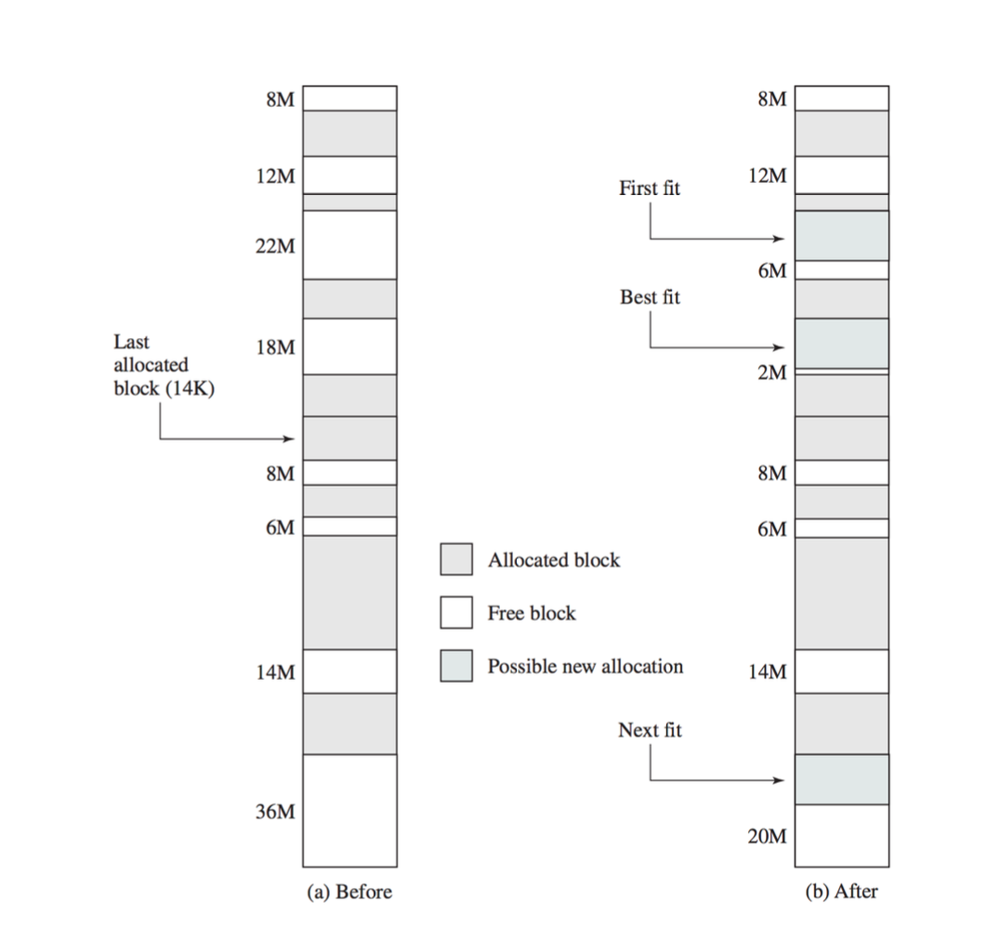
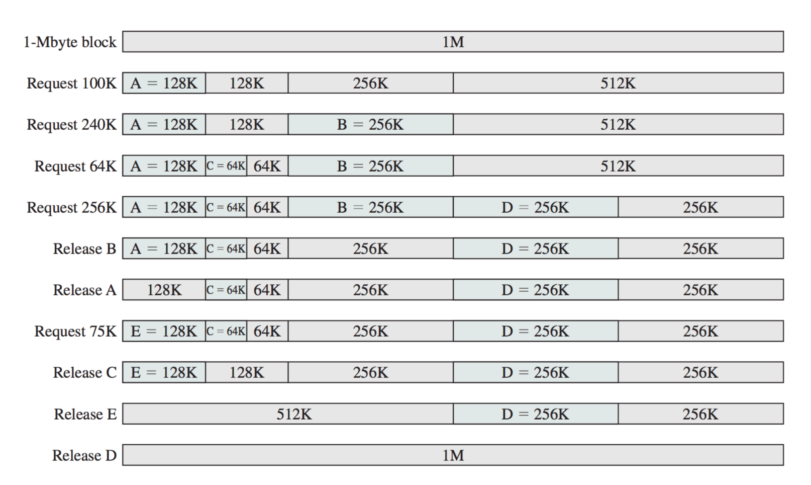

# Introduction to Dynamic Memory Allocation

* The **heap** is a large memory region managed by the programmer and is the primary area where **dynamic (run-time) memory allocation** occurs
* In C, the primary functions for allocation and deallocation are `malloc()` and `free`

## Memory Allocation in C

* `malloc()`: Allocates memory dynamically based on the request size.
  * Example: `malloc(sizeof(int))` allocates enough memory to store an integer and returns a pointer to this memory location
* `free()`: Frees the allocated memory, making it available for future use. However, the memory content is not necessarily cleared or reused immediately, leading to potential issues if the pointer is accidentally used after being freed

## Memory Allocation and Leaks

* **Memory Leaks**: Occur when memory is allocated but never deallocated using `free()`
  * Memory leaks are a significant issue in programming, especially in long running applications
  * **Example**: Allocating memory for a dynamic array without freeing it after use will cause a memory leak

## Fulfilling Memory Requests

* The OS tries to find free memory blocks to satisfy requests. While modern systems have ample memory, there is still a possibility that a request cannot be fulfilled if an appropriate block size is unavailable

## Fixed Block Sizes

* **Fixed Block Allocation**: Memory is divided into blocks of a fixed size (e.g. 1KB)
  * Every memory request is rounded up to the nearest block size
  * **Example**: A request for 1.5 blocks would result in two blocks being allocated
  * **Internal Fragmentation**: This results in wasted memory since the excess portion of the last allocated block cannot be used
  * **Fast Allocation**: Allocation with fixed block sizes is efficient, typically done in constant time **O(1)**

## Variable Block Sizes

* **Variable Block Allocation**: Memory is allocated in variable-sized blocks to fit the exact memory requested. 
  * The smallest block size is usually 1 byte (in a byte-addressable system)
* **Tracking Allocated Memory**: There are different ways to track allocated and free memory, such as **bitmaps** and **linked lists**

### Bitmap Approach

* Memory is divided into fixed-size units, and each unit's status (allocated or free) is recorded in a **bit array**
  * **Overhead**: The bitmap takes a small portion of memory (e.g., ~0.8% for 6-byte units)
  * **Finding Free Space**: To allocate memory, the OS must search the bitmap for a sequence of zeros (piece of memory) large enough to fit the requested memory

### Linked List Approach

* A linked list can be used to manage free and allocated blocks. Initially all memory is represented as one large free block
  * **Allocation**: When a block is requested, it is divided, and a new node is added to the ist representing the allocated block
  * **Deallocation**: When a block is freed, its not in the list is marked as free

## Coalescence and Fragmentation

* **Coalescence**: When two adjacent blocks of free memory are found, they can be merged into one larger block to reduce fragmentation
* **External Fragmentation**: Occurs when free memory is spread out into small, non-contiguous blocks. Even though there may be enough total memory, the system can not satisfy a large memory request due to fragmentation

## Memory Compaction

* **Compaction**: A technique to solve external fragmentation by moving allocated memory blocks next to each other, creating a large contiguous free block.
  * This process is costly
  * **Example in Java**: The Java runtime performs companion during garbage collection, reallocating references, but this is difficult in languages like C, where memory addresses are used directly

## Allocation Strategies

Various strategies exist for deciding how to allocate memory when multiple free blocks are available:

1. **First Fit**: The first block that is large enough is used
  * **Runtime**: **O(n)**, where `n` is the number of blocks
2. **Next Fit**: Similar to first fit but the search starts from the last allocated block
3. **Best Fit**: Choosees the smallest block that is still large enough to satisfy the request
  * **Potential Issue**: This can leave small, unusable fragments
4. **Worst Fit**: Allocates memory from the largest available block, hoping remaining portion will still be usable
5. **Quick Fit**: Optimizes allocations by keeping separate lists for commonly requested block sizes

## Binary Buddy System

* The **Binary Buddy System** is a compromise between fixed and variable allocation. Memory is divided into blocks of power-of-2 sizes
  * **Example**: Memory blocks may be 2 KB, 4 KB, 8 KB, etc. If a request for 3 KB is made, a 4 KB block is allocated. If two adjacent blocks are free, they can be merged into a larger block (coalescence).
  * **Benefits**: This system provides a balance between internal and external fragmentation and allows for efficient coalescence of free blocks

### Choosing a Strategy

* **First Fit vs. Best Fit**: First fit tends to be faster, while best bit can reduce memory waste, but may create unusable fragments
* **Worst Fit**: This strategy generally performs poorly and results in the most wasted space
* **Next Fit**: Avoids cluttering the start of the memory with small fragments but allocating blocks near the end of memory