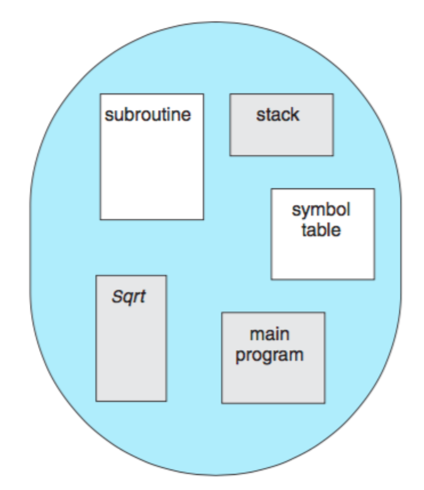
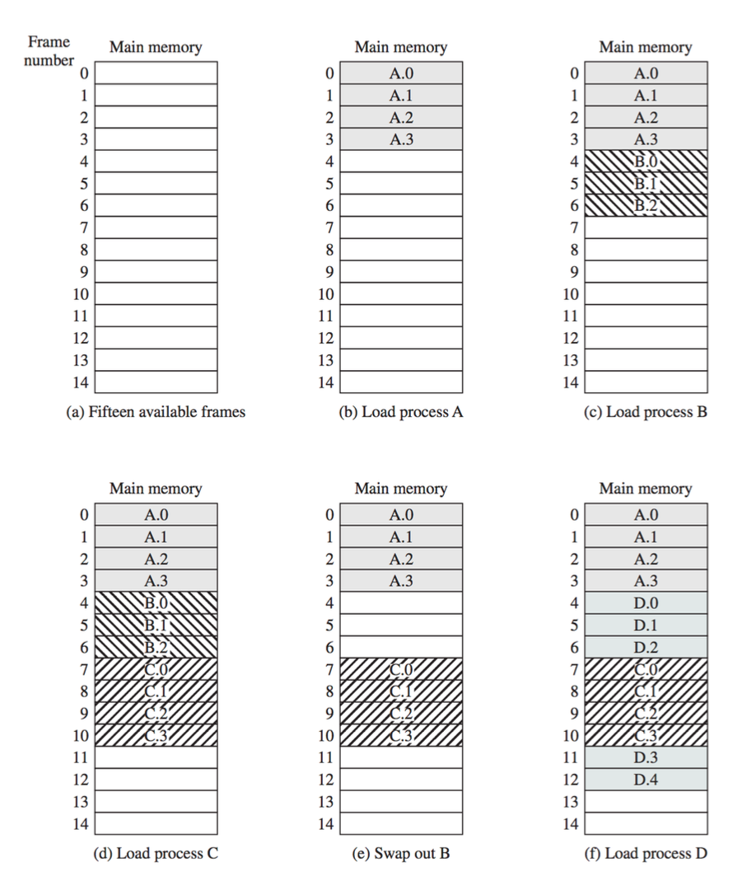
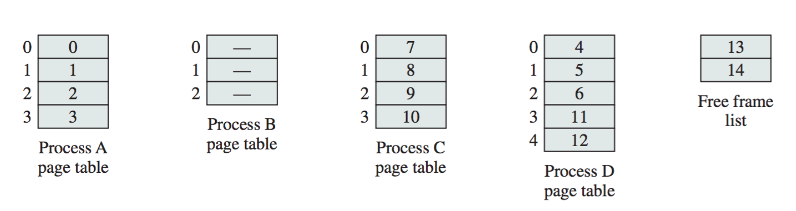
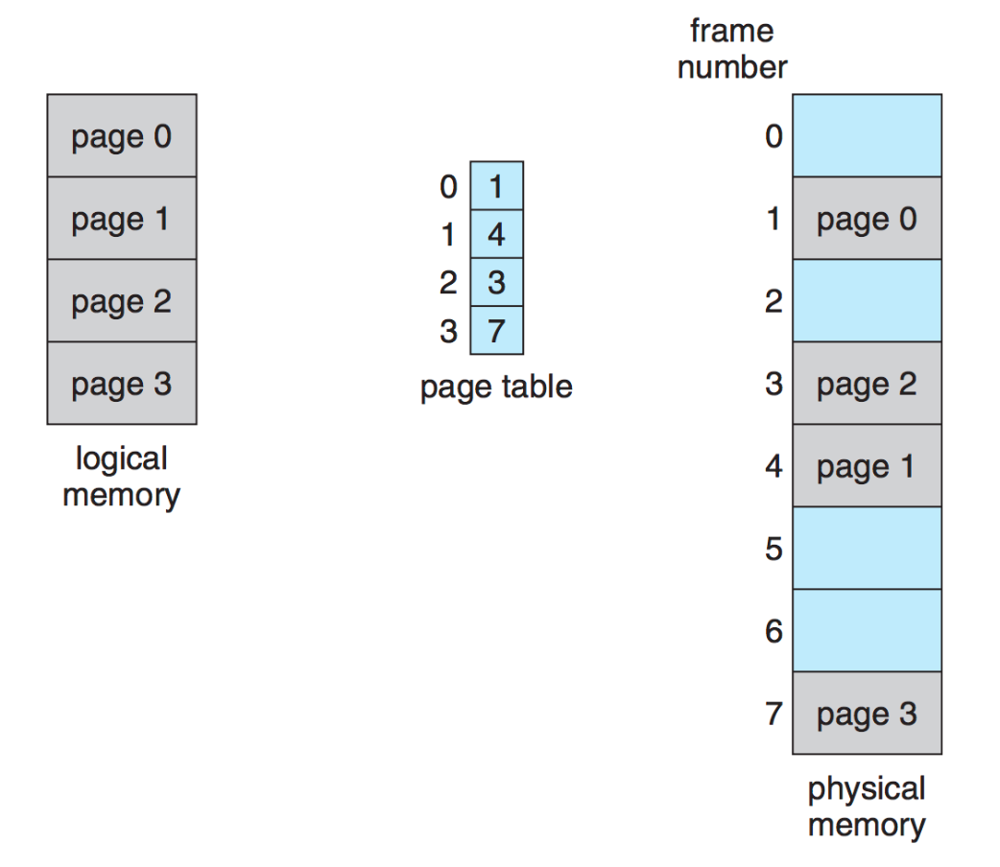
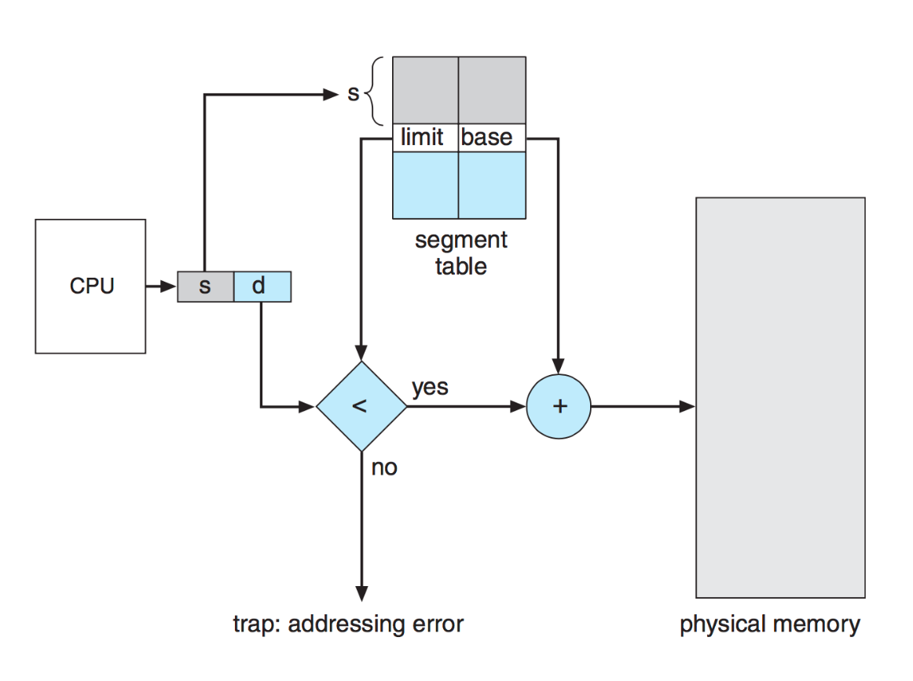
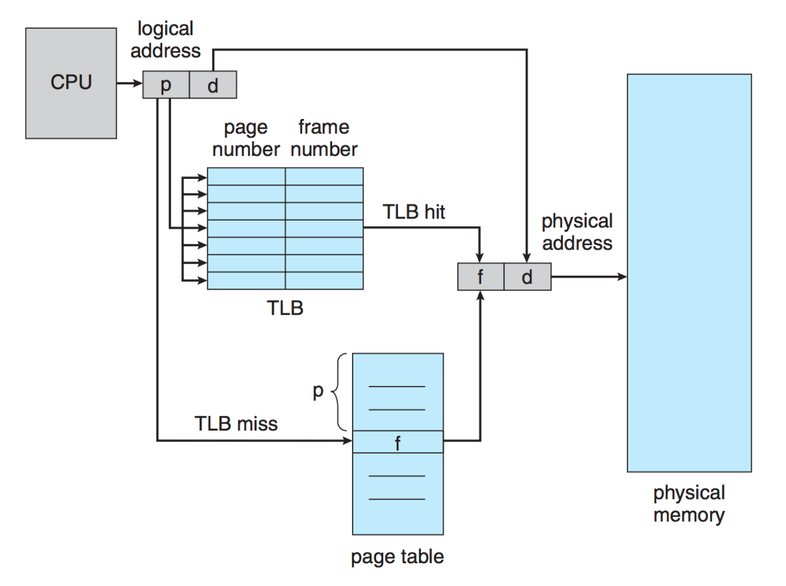

# Memory Management

* Memory management becomes more complex in larger systems (desktop/laptop)
* Memory is often thought of as a **linear array of bytes**, but in reality, it is divided into **segments** that represent different parts of the program (stack, heap, code, libraries, etc.)

## Memory Segmentation

* **Segments** represent different parts of the program: code, gloabal variables, heap, stack and standard libraries. 
  * These segments vary in size and are managed by the compiler
* Rather than seeing memory as one large block, it can be though of as a tuple: `<segment, offset>`
  * **Segment Table**: Each segment is mapped to a memory address using a segment table. Each table entry contains:
    1. **Base**: Starting address of the segment
    2. **Limit**: Size of the segment
  * **Implementation**: The segment table ensures that memory access is within the limits of the segment, using comparisons then additions

### Memory Segments

1. Code (instructions)
2. Global variables
3. Heap
4. Stack (one per thread)
5. Standard C library

## Paging

* **Paging** is a memory management scheme that allows the seperation of **logical addesses** (what the program sees) from **physical addresses** (the actual location in memory)
  * This scheme divides both memory and processes into fixed-size chunks to optimize the allocation and retrieval in of memory

### How Paging Works

1. **Logical and Physical Seperation**:
  * **Logical Address**: The address generated by the CPU that the program uses to refer to data
  * **Physical Addresses**: The actual location in the main memory (RAM) where data is stored
  * Paging breaks the down the process's memory down into **pages** (logical units) and the physical memory into **frames** (physical units) both of equal size.
  * Each **page** from a process can be mapped to any available frame in physical memory
2. **Page Table**:
  * A **page table** is maintained to map **logical page numbers** to **physical frame numbers**.
  * When a process trues to access data at a logical address, the page table translates it to the corresponding physical address
  * **Example**:
    * Logical Address: Page 3, Offset 128
    * Page Table: Maps Page 3 to Frame 7
    * Physical Address: Frame 7, Offset 128

### Benefits of Separating Logical and Physical Addresses

1. **Flexibility**: Processes no longer need to be loaded into contiguous blocks of physical memory. Pages can be scattered across frames, making better use of the available memory
2. **Isolation and Security**: Since processes operate within their own logical address spaces, they are isolated from each other, preventing unauthorized access to other process' memory
3. **Efficiency**: The OS can allocate memory more efficiently by using available frames even if they are scattered

### Fragmentation: How Paging Addresses It

* **External Fragmentation**: 
  * Paging completely eliminates external fragmentation because physical memory is divided into fixed-size **frames**, and each frame can hold exactly one page. Since pages and frame are all the same size, any free frame can be used for any page
  * This means memory allocation can occur anywhere in physical memory, no matter how fragmented the free space
  **Example**:
    * **Without Paging**: You may have 10 KB of free memory, but it's scattered across different locations in 2 KB chunks, so you cant allocate a 5 KB block
    * **With Paging**: As long as there are enough free frames, a process's pages can be scatted across them (e.g. 5 total 1 KB blocks), regardless of where they are in physical memory

* **Internal Fragmentation**: 
  * **Paging does not eliminate internal fragmentation completly**, but minimizes it. The only internal fragmenation that can occur is at the end of a process where the last page migh not be fully utilized. 
  * However, this is limited to at most **one page** per process, which is reletivly small
  * **Example**:
    * If a page size is 4 KB and a process needs 10 KB of memory, three pages (12 KB) are allocated.
    * The last page will have 2 KB of unused space, representing internal fragemenation, but this is still far better than the fragmentaition problems that occur without paging
* **Tradeoff Between Internal and External Fragmentation**:
  * External fragmentation can leave large portions of memory unuable, whule itnernal fragmentation only wastes a small amount at the end of the process's memory space

### Why Fixed-Size Blocks Minimize Fragmentation

* By dividing memory into **fixed-size pages and frames**, paging ensures that memory is used efficiently
  * There are **no small, scattered free blocks** (external fragmentation) because pages can be placed anywhere
  * the only internal fragmentation happens when the last page of a process isn't fully used which is typically much smaller than external fragmentation

### Page Size Considerations

* **Smaller Pages**: Reduce internal fragmentation but require more pages, which introduces overhead
* **Larger Pages**: Reduce overhead but increase the chance of wasted memory in partially filled pages
* **Disk Efficiency**: Page size is often aligned with the block size of disk read/write operations to ensure efficient memory-disk operations (e.g swapping pages between disk and memory)

### Protection and Shared Pages

* **Protection**: Paging provides protection by ensuring that a program cannot access memory outsize its allocated pages
* **Shared Pages**: Allows memory to be shared across processes
  * **Example**: Multiple instances of the same program (e.g `vim`) can share teh same code pages, saving memory space
  * **Reentrant Code**: Shared pages must contain **reentrant code** (stateless, unchanging code) to ensure safe sharing

### Page Table Structures

Three strategies exist to manage the potentially large tables in moden systems:

1. **Hierarchial Paging**: Breaks the page table into multiple levels, making it easier to manage non-contiguous statements
  * **Two-Level System**: The first part of the address identifies the **outer page**, which points to an **inner page**
2. **Hashed Page Tables**: Uses a **hash function** to assign pages to "buckets" in a hash table. Each bucket is a linked list that is searched to find the matching page
3. **Inverted Page Tables**: Instead of having one entry per page, it has one entry per frame. This drastically reduces the size of the page table but makes it slower because searching is required

### Hardware Support for Paging

* **Registers**: Older systems used a lot of dedicated registers to store the page table, but this method becomes impractical with larger page tables (e.g. 1 million entries)
* **Memory Access Latency**: Accessing memory involves two steps:
  1. Access the **page table** to find where the page is stored
  2. Access the **page** in memory. This doubles the time required for each read/write operation, but is too slow for practical use

### Translation Lookaside Buffer (TLB)

* **TLB**: A fast, **cache-like** structure used to speed up memory access.
  * It stores recent page table entries (key-value pairs: logical addresses -> physical addresses) to avoid looking them up repeatedly in memory
    **TLB Miss**: When a page is not found in the TLB, the system must refer to the page table, which is slower
    **Size**: The TLB typically contains a limited number of entries (32 to 1024)

### Caching and TLB Operation

* The **TLB** is an example of **caching**, where recently accessed data (page table entries) is kept in a faster storage medium for quicker access
* **Caching Principle**: Everything learned about caching in previous discussions applies here as well: frequently used addresses are kept in the TLB to reduce lookup times

* **Paging** solves issues of fragmentation (both internal and external) seen in other memory management schemes
  * Memory is divided into small, fixed-size chunks called **frames**
  * A process's memory is divided into **pages** (same size as frames), and each page can be mapped to any frame in memory